<div align="center">

# Informe de Trabajo Final

## Universidad Peruana de Ciencias Aplicadas


**Curso: Desarrollo de Aplicaciones Open Source**  
**Sección: 4321**  
**Profesor: Rafael Oswaldo Castro Veramendi**  
**Carrera: Ingeniería de Software**  
**Ciclo: 2025-01**  
**Startup:**  
**Producto: NutriGain**

### Integrantes:

| Nombre                         | Código       |
|--------------------------------|--------------|
| Pumahualcca Garcia, Diego Rodrigo | U202219266 |
| Méndez Vargas Sebastian Orlando | U20201F140   |
| Gordillo Ramos Santiago Alonso | U202215160   |
| Vera Nuñez Nicolas Alejandro   | u202214869   |
| Huapaya Buitron Ariana Alheli  | U201819645   |
  
</div>

<div align="justify">

<br>

# Project Report Collaboration Insights

URL del repositorio para el reporte del proyecto: https://github.com/UPC-NutriGain/Informe/tree/main?tab=readme-ov-file

TB1: Las tareas asignadas para la entrega TB1 se han completado y están documentadas en el siguiente repositorio de Github perteneciente a la organización del equipo:


Durante la preparación del informe, se llevaron a cabo las siguientes actividades:

- Se escribieron y graficaron los contenidos asignados a cada miembro en formato Markdown, seguido de commits para monitorear el progreso de cada integrante en el repositorio.
- Se crearon los artefactos necesarios utilizando las herramientas indicadas en el PDF del proyecto.
- Se organizaron reuniones para asignar las tareas, para coordinar el progreso de los elementos del informe y para comunicar los avances del primer Sprint.

<br>

|Integrante|Tareas Asignadas|
|---|---|
|Ariana Huapaya|xxxxxx.<br>xxxxxxx.<br>xxxxx<br>xxxxxx<br>xx.<br>xxx.<br>xxxx.<br>Landing Page<br>Sprint 1|
|Santiago Gordillo|xxxx.<br>xxxx<br>xxxxx<br>xxxxxx<br>xxxxxx<br>xxxxx<br>xxxxx<br>xxxxx<br>Landing Page<br>Sprint 1|
|Sebastian Mendez|General Style Guidelines<br>Web Style Guidelines<br>Information Architecture<br>Landing Page UI Design<br>Domain-Driven Software Architecture (C4 Diagrams)<br>Class Diagram<br>Database Diagram<br>Landing Page<br>Sprint 1|
|Diego Pumahualcca|Análisis competitivo <br>Estrategias y tácticas frente a competidores <br>Diseño de entrevistas <br>Registro de entrevistas <br>Análisis de entrevistas <br>User Task Matrix <br>User Journey Mapping <br>Empathy Mapping<br>Landing Page<br>Sprint 1|
|Nicolas Vera|Impact Map.<br>AS-IS Map.<br>TO-BE Map.<br>User Stories.<br>Product Backlog.<br>User Persona.<br>Nav bar del Landing.<br>Hero section del landing.<br>Responsive del landing.<br>Animación del landing.<br>Botón de traducción del landing.<br>Sprint 1|

## GitHub Insights
GitHub nos permite exponer una linea de tiempo de nuestras ramas principales y el proceso al que se han sometido. Tdodas las ramas creadas fue en base al diseño de GitFlow para una buena organización y control de versiones.

Los integrantes del equipo son:
* Ariana Huapaya (arianahuapayabui)
* Santiago Gordillo (SantiIHC)
* Sebastian Mendez (el-tres-palabritas)
* Diego Pumahualcca  (DiegoPumahualcca)
* Nicolas Vera (nicxlxs)

**Student Outcomes**

|Criterio específico|Acciones realizadas|Conclusiones|
|---|---|---|
|Comunica oralmente sus ideas y/o resultados con objetividad a público de diferentes especialidades y niveles jerárquicos, en el marco del desarrollo de un proyecto en ingeniería.|**Ariana Huapaya**<br>TB1:xxxx<br><br>**Santiago Gordillo**<br>TB1:<br>xxxxxxx<br><br>**Sebastian Mendez**<br>TB1: <br>Expreso de manera clara y objetiva mis aportes y conclusiones sobre la arquitectura del software y el diseño de la experiencia de usuario, adaptando mi forma de comunicarme según el perfil técnico del público, dentro del desarrollo de un proyecto de ingeniería con equipos de distintas especialidades.<br><br>**Diego Pumahualcca**<br>TB1:<br>Comunica de manera clara, convincente y basada en evidencias los hallazgos del proyecto, adaptando su lenguaje y enfoque según el perfil del público. Utiliza datos reales, ejemplos contextualizados y recursos visuales para facilitar la comprensión, logrando que tanto equipos técnicos como stakeholders tomen decisiones informadas en el marco del desarrollo en ingeniería.<br><br>**Nicolas Vera**<br>TB1:<br>Durante el desarrollo de los entregables como el Impact Map, AS-IS Map, TO-BE Map y User Stories, comprendí la importancia de identificar y priorizar correctamente las necesidades de los futuros usuarios. Además, gracias a reuniones constantes con mis compañeros, fortalecí mi capacidad de comunicar ideas de manera clara para construir soluciones innovadoras y efectivas.|La comunicación oral ha sido efectiva dentro del equipo, permitiendo un intercambio fluido de ideas y una comprensión compartida de los objetivos del proyecto. Se continuará fomentando esta comunicación para mantener la colaboración y el progreso del trabajo.|
|Comunica en forma escrita ideas y/o resultados con objetividad a público de diferentes especialidades y niveles jerárquicos, en el marco del desarrollo de un proyecto en ingeniería.|**Ariana Huapaya**<br>TB1:xxxxx<br><br>**Santiago Gordillo**<br>TB1:<br>xxxxxx<br><br>**Sebastian Mendez**<br>TB1:<br>Redacto con objetividad y claridad mis ideas y resultados relacionados con el desarrollo del proyecto de ingeniería, adecuando el nivel técnico de mi comunicación escrita según el perfil del público, ya sean especialistas o personas de otros niveles jerárquicos.<br><br>**Diego Pumahualcca**<br>TB1:<br>Redacto informes técnicos y ejecutivos con objetividad y claridad, adaptando el nivel de detalle y formato según el perfil del público. Transforma datos complejos en entregables comprensibles y visuales, facilitando la toma de decisiones informadas por parte de equipos interdisciplinarios y niveles jerárquicos diversos dentro del proyecto de ingeniería.<br><br>**Nicolas Vera**<br>TB1:<br>La elaboración de entregables como el Product Backlog, User Personas, Impact Map, y la estructura del Landing Page (Nav bar, Hero Section, Responsive, Animación y Botón de traducción) me permitió comunicar de forma escrita las ideas clave del proyecto. Gracias a este proceso de documentación, se logró mantener una línea clara de desarrollo, facilitando la comprensión de los entregables por parte de todos los miembros del equipo.|La comunicación escrita ha sido crucial para documentar el progreso del proyecto y asegurar la comprensión de los entregables entre los miembros del equipo. Se seguirá manteniendo un enfoque claro y conciso en la comunicación escrita para garantizar la eficacia y la calidad del trabajo.|

La colaboración en la creación del informe se llevó a cabo a través de una serie de contribuciones constantes al repositorio de la organización NutriGain.


# Contenido

## Tabla de contenidos

### [Registro de versiones del informe](#registro-de-versiones-del-informe)

### [Project Report Collaboration Insights](#project-report-collaboration-insights)

### [Student Outcome](#student-outcome)

## [Capítulo I: Introducción](#capítulo-i-introducción)

- [1.1. Startup Profile](#11-startup-profile)
  - [1.1.1. Descripción de la Startup](#111-descripción-de-la-startup)
  - [1.1.2. Perfiles de integrantes del equipo](#112-perfiles-de-integrantes-del-equipo)
- [1.2. Solution Profile](#12-solution-profile)
  - [1.2.1 Antecedentes y problemática](#121-antecedentes-y-problemática)
  - [1.2.2 Lean UX Process](#122-lean-ux-process)
    - [1.2.2.1. Lean UX Problem Statements](#1221-lean-ux-problem-statements)
    - [1.2.2.2. Lean UX Assumptions](#1222-lean-ux-assumptions)
    - [1.2.2.3. Lean UX Hypothesis Statements](#1223-lean-ux-hypothesis-statements)
    - [1.2.2.4. Lean UX Canvas](#1224-lean-ux-canvas)
- [1.3. Segmentos objetivo](#13-segmentos-objetivo)

## [Capítulo II: Requirements Elicitation & Analysis](#capítulo-ii-requirements-elicitation--analysis)

- [2.1. Competidores](#21-competidores)
  - [2.1.1. Análisis competitivo](#211-análisis-competitivo)
  - [2.1.2. Estrategias y tácticas frente a competidores](#212-estrategias-y-tácticas-frente-a-competidores)
- [2.2. Entrevistas](#22-entrevistas)
  - [2.2.1. Diseño de entrevistas](#221-diseño-de-entrevistas)
  - [2.2.2. Registro de entrevistas](#222-registro-de-entrevistas)
  - [2.2.3. Análisis de entrevistas](#223-análisis-de-entrevistas)
- [2.3. Needfinding](#23-needfinding)
  - [2.3.1. User Personas](#231-user-personas)
  - [2.3.2. User Task Matrix](#232-user-task-matrix)
  - [2.3.3. User Journey Mapping](#233-user-journey-mapping)
  - [2.3.4. Empathy Mapping](#234-empathy-mapping)
  - [2.3.5. As-is Scenario Mapping](#235-as-is-scenario-mapping)
- [2.4. Ubiquitous Language](#24-ubiquitous-language)

## [Capítulo III: Requirements Specification](#capítulo-iii-requirements-specification)

- [3.1. To-Be Scenario Mapping](#31-to-be-scenario-mapping)
- [3.2. User Stories](#32-user-stories)
- [3.3. Impact Mapping](#33-impact-mapping)
- [3.4. Product Backlog](#34-product-backlog)

## [Capítulo IV: Product Design](#capítulo-iv-product-design)

- [4.1. Style Guidelines](#41-style-guidelines)
  - [4.1.1. General Style Guidelines](#411-general-style-guidelines)
  - [4.1.2. Web Style Guidelines](#412-web-style-guidelines)
- [4.2. Information Architecture](#42-information-architecture)
  - [4.2.1. Organization Systems](#421-organization-systems)
  - [4.2.2. Labeling Systems](#422-labeling-systems)
  - [4.2.3. SEO Tags and Meta Tags](#423-seo-tags-and-meta-tags)
  - [4.2.4. Searching Systems](#424-searching-systems)
  - [4.2.5. Navigation Systems](#425-navigation-systems)
- [4.3. Landing Page UI Design](#43-landing-page-ui-design)
  - [4.3.1. Landing Page Wireframe](#431-landing-page-wireframe)
  - [4.3.2. Landing Page Mock-up](#432-landing-page-mock-up)
- [4.4. Web Applications UX/UI Design](#44-web-applications-uxui-design)
  - [4.4.1. Web Applications Wireframes](#441-web-applications-wireframes)
  - [4.4.2. Web Applications Wireflow Diagrams](#442-web-applications-wireflow-diagrams)
  - [4.4.3. Web Applications Mock-ups](#443-web-applications-mock-ups)
  - [4.4.4. Web Applications User Flow Diagrams](#444-web-applications-user-flow-diagrams)
- [4.5. Web Applications Prototyping](#45-web-applications-prototyping)
- [4.6. Domain-Driven Software Architecture](#46-domain-driven-software-architecture)
  - [4.6.1. Software Architecture Context Diagram](#461-software-architecture-context-diagram)
  - [4.6.2. Software Architecture Container Diagrams](#462-software-architecture-container-diagrams)
  - [4.6.3. Software Architecture Components Diagrams](#463-software-architecture-components-diagrams)
- [4.7. Software Object-Oriented Design](#47-software-object-oriented-design)
  - [4.7.1. Class Diagrams](#471-class-diagrams)
  - [4.7.2. Class Dictionary](#472-class-dictionary)
- [4.8. Database Design](#48-database-design)
  - [4.8.1. Database Diagram](#481-database-diagram)

## [Capítulo V: Product Implementation, Validation & Deployment](#capítulo-v-product-implementation-validation--deployment)

- [5.1. Software Configuration Management](#51-software-configuration-management)
  - [5.1.1. Software Development Environment Configuration](#511-software-development-environment-configuration)
  - [5.1.2. Source Code Management](#512-source-code-management)
  - [5.1.3. Source Code Style Guide & Conventions](#513-source-code-style-guide--conventions)
  - [5.1.4. Software Deployment Configuration](#514-software-deployment-configuration)
- [5.2. Landing Page, Services & Applications Implementation](#52-landing-page-services--applications-implementation)

  - [5.2.1. Sprint 1](#521-sprint-1)
    - [5.2.1.1. Sprint Planning 1](#5211-sprint-planning-1)
    - [5.2.1.2. Sprint Backlog 1](#5212-sprint-backlog-1)
    - [5.2.1.3. Development Evidence for Sprint Review](#5213-development-evidence-for-sprint-review)
    - [5.2.1.4. Testing Suite Evidence for Sprint Review](#5214-testing-suite-evidence-for-sprint-review)
    - [5.2.1.5. Execution Evidence for Sprint Review](#5215-execution-evidence-for-sprint-review)
    - [5.2.1.6. Services Documentation Evidence for Sprint Review](#5216-services-documentation-evidence-for-sprint-review)
    - [5.2.1.7. Software Deployment Evidence for Sprint Review](#5217-software-deployment-evidence-for-sprint-review)
    - [5.2.1.8. Team Collaboration Insights during Sprint](#5218-team-collaboration-insights-during-sprint)

- [5.3. Validation Interviews](#53-validation-interviews)

  - [5.3.1. Diseño de entrevistas](#531-diseño-de-entrevistas)
  - [5.3.2. Registro de entrevistas](#532-registro-de-entrevistas)
  - [5.3.3. Evaluación según heurísticas](#532-evaluación-según-heurísticas)

- [5.4. Video about the product](#54-video-about-the-product)

# Capítulo I: Introducción

# 1.1. Startup Profile
### 1.1.1.Descripcion de la startup
Nuestra Startup llamado NutriGain es una app de entrenamiento personalizada y divertida que se adapta a los intereses y objetivos del usuario. Al comenzar, el usuario elige su camino fitness (Crecimiento muscular, Deportes de agilidad o Yoga) y un personaje virtual lo acompañará en su progreso, ajustando su rutina semanal, su plan nutricional y ofreciendo desafíos únicos y aleatorios. La app también introduce un reto diario extremo que desafía al usuario a mejorar constantemente.


##### Misión: Impulsar al usuario a alcanzar sus objetivos físicos a través de entrenamientos personalizados, nutrición adaptada y una experiencia interactiva gamificada.
##### Visión: Ser la aplicación líder en fitness personalizado en Latinoamérica, motivando a millones de personas a transformar su salud física y mental.
### 1.1.2. Perfil de los integrantes

- Mi nombre es Ariana Huapaya Buitron, soy estudiante ingeniería de Software, nos enfocamos en la programación, la adaptabilidad y la naturaleza dinámica del software, ya sea en su desarrollo desde cero o en la mejora de uno existente. Aplicamos técnicas y métodos propios de la ingeniería para asegurar su calidad, así como para ofrecer mantenimiento y soporte operativo continuo. Tengo conocimiento en Python, C++, SQL y principalmente Javascript y Nodejs de los cuales tengo conocimiento para crear aplicaciones Back-end y APIS. Además tengo habilidades en lo que respecta a la resolución de problemas
  


-----------------------------------------------------------------------------------------
- Mi nombre es Santiago Gordillo Ramos, soy estudiante de ingeniería de software, tengo 21 años. Me gusta el lenguaje python y tengo conocimiento intermedio en los demás lenguajes.


-----------------------------------------------------------------------------------------
- Mi nombre es Nicolas Alejandro Vera Nuñez, tengo 19 años y estudio Ingeniería de Software. En mi tiempo libre, disfruto jugar videojuegos o practicar fútbol. Soy una persona capaz de trabajar en equipo, detallista y destacada en la creación de user personas, elaboración de diagramas y programación. Mi motivación para seguir aprendiendo es llegar a crear y diseñar soluciones creativas. Me considero creativo, proactivo, tolerante, respetuoso y apasionado por lo que me gusta. Me comprometo a apoyar en el proceso para lograr un proyecto final bien planteado y obtener una buena nota.


-----------------------------------------------------------------------------------------
- Mi nombre es Sebastian Méndez y estudio la carrera de Ingeniería de Software en UPC. Me apasiona el desarrollo web y actualmente estoy realizando prácticas como Frontend Developer. Cuento con conocimientos en tecnologías como: HTML5, CSS5, JavaScript, TypeScript y C#. En mis ratos libres practico mecanografía, voy al gimnasio o juego algo.

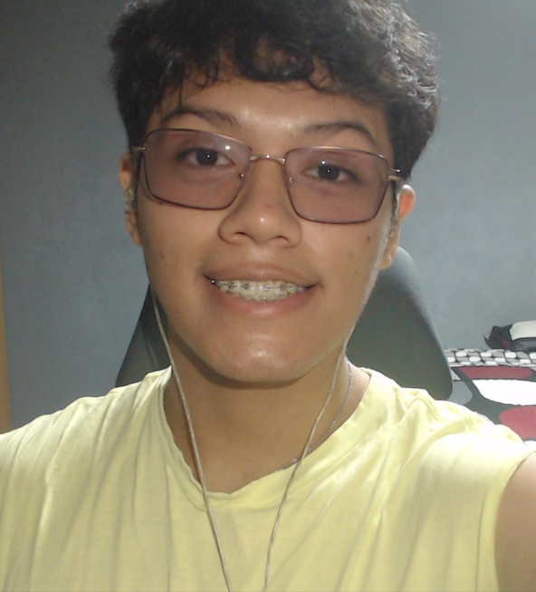

-----------------------------------------------------------------------------------------
Mi nombre es Diego Pumahualcca y tengo 19 años. Estoy cursando la carrera de Ingeniería de Software en la UPC. Elegi la carrera, porque me interese por la creacion de paginas web y el diseño web. Con el paso del tiempo me gusto hacer los diagramas de clases, contexto, contenedores, componentes, etc.


# 1.2. Solution Profile
### 1.2.1.Antecedentes y problemática
### What (Qué)  
**¿Cuál es el problema?**  
Muchas personas desean mejorar su condición física o adoptar hábitos más saludables, pero enfrentan dificultades para mantenerse motivadas, encontrar un plan que se adapte a sus objetivos específicos o seguir una rutina constante. Las aplicaciones tradicionales de fitness suelen ser genéricas, poco dinámicas y no se adaptan a los cambios en el progreso o intereses de los usuarios.

### Where (Dónde)  
**¿A dónde se dirige?**  
Este problema afecta a usuarios en todo el Perú, especialmente en zonas urbanas donde el estilo de vida acelerado dificulta mantener un plan de ejercicio y alimentación constante.

### Why (Por Qué)  
**¿Cuál es la causa del problema?**  
La mayoría de las aplicaciones de fitness actuales no logran conectar emocionalmente con el usuario, y no personalizan adecuadamente la experiencia. Además, muchas personas no cuentan con la guía profesional necesaria para estructurar un plan de ejercicio y nutrición que se alinee con sus metas individuales.

### When (Cuándo)  
**¿Cuándo sucede el problema?**  
El problema aparece desde el momento en que una persona decide comenzar a ejercitarse sin orientación adecuada o pierde motivación rápidamente por falta de seguimiento y variedad.

### Who (Quién)  
**¿Quiénes están involucrados? ¿Quién lo utilizará?**  
Los principales usuarios son jóvenes y adultos interesados en fitness, salud y bienestar, desde principiantes hasta deportistas intermedios.

### How (Cómo)  
**¿Cómo se utilizará el producto?**  
NutriGain se utilizará desde una aplicación móvil. Al iniciar, el usuario elige un camino (Crecimiento Muscular, Deportes de Agilidad, Yoga) y un personaje virtual lo acompañará en todo su proceso, adaptando semanalmente su rutina de ejercicios, dieta y desafíos. 

### How Much (Cuánto)  
**¿Cuál es la magnitud del problema?**  
El índice de sobrepeso, estrés y enfermedades que genera una vida sedentaria.

## 1.2.2. Lean UX Process
##### 1.2.2.1. **Lean UX Problem Statements** 
**Problem Statement**

Existe una desconexión entre los planes de entrenamiento estándar y los objetivos individuales de los usuarios, lo que genera desmotivación y abandono temprano del estilo de vida saludable. Las personas necesitan una herramienta atractiva y personalizada que les permita entrenar de forma eficiente, adaptada a su ritmo y objetivos. NutriGain busca llenar ese vacío mediante una app que ofrece una experiencia divertida, motivadora y orientada al progreso real del usuario.

##### 1.2.2.2. Lean UX Assumptions
**Business Assumptions**
1. **Asumimos que nuestros usuarios** buscan mejorar su salud física y mental a través de rutinas de entrenamiento personalizadas y sostenibles en el tiempo.
2. **Estas necesidades seran abordadas** mediante una app que combina entrenamiento físico, nutrición y motivación a través de gamificación y personajes virtuales.
3. **Los primeros usuarios serán** jovenes y adultos con hábitos digitales, interesados en fitness, que usan el celular para entrenar y organizar su dieta.
4. **El valor principal que esperan de nuestra aplicación es poder** acceder a rutinas personalizadas, seguimiento de su progreso, retos motivacionales y un plan nutricional integrado.
5. **Los clientes obtendrán** logros semanales, participación en desafíos y seguimiento completo del plan.
6. **Planeamos atraer usuarios a través de** campañas en redes sociales, influencers fitness y desafíos virales.
7. **Generaremos ingresos en** funciones avanzadas de pago como una suscrpción premium(planes nutricionales personalizados, análisis de progreso en profundidad, rutinas premium), y anuncios de marcas saludables.
8. **Nuestra competencia incluye** apps como Nike Training Club, Freeletics o MyFitnessPal.
9. **Creemos que nuestra ventaja competitiva radica** en la experiencia gamificada, el acompañamiento de un personaje virtual y la integración de entrenamiento y nutrición en un mismo lugar.
10. **El mayor riesgo es que** los usuarios no mantengan el hábito de uso diario o perciban la app como poco útil si no sienten resultados rápidos.
11. **Enfrentaremos estos riesgos a través de** pruebas gratuitas, comunidad activa y actualizaciones constantes basadas en feedback.

**User Assumptions**

**¿Quién es el usuario?**

Jóvenes y adultos, entusiastas del fitness, que buscan mejorar su estado físico ya sea por salud o recreacional.

**¿Qué problemas enfrenta nuestro producto? ¿Cómo los resolveremos?**

El principal desafío es el mercado saturado. Lo abordamos con personalización real, gamificación, personajes virtuales que acompañan el progreso, y retos diarios únicos.

**¿Qué características son importantes?**

La interfaz fácil de utilizar, el personaje virtual que acompañará al usuario, los planes nutricionales, las rutinas, etc.

**¿Dónde encaja nuestro producto en su trabajo o vida?**

En el día a día de personas activas o que quieren adoptar un estilo de vida saludable

**¿Cuándo y cómo se usa nuestro producto?**

Durante el entrenamiento en casa o gimnasio. La app guía la rutina diaria, ofrece retroalimentación, consejos nutricionales y retos.

**¿Cómo debe ser y comportarse nuestro producto?**

visualmente atractivo y con capacidad de adaptación al progreso y gustos del usuario. Debe mantener al usuario motivado, brindando contenido variado, desafiante y útil.

##### 1.2.2.3. Lean UX Hypothesis Statements

- **Hypothesis Statement 01**

**Creemos que** los usuarios fitness valorarán una app que les ofrezca un acompañamiento virtual personalizado.

**Sabremos** que hemos tenido éxito.

**Cuando** los usuarios pasen aunque sea mas de 3 semanas en la aplicación.

- **Hypothesis Statement 02**

**Creemos que** al implementar desafíos diarios extremos aumentaremos el nivel de compromiso.

**Sabremos** que hemos tenido éxito

**Cuando** mas del 60% de los usuarios completen los retos.

- **Hypothesis Statement 03**

**Creemos que** al ofrecer diferentes caminos fitness (musculación, agilidad o yoga), atraeremos a una audiencia más amplia.

**Sabremos** que hemos tenido éxito.

**Cuando** cada camino utilizado marque aunque sea el 50% de usuarios activos.

- **Hypothesis Statement 04**

**Creemos que** al incluir una sección de nutrición personalizada aumentaremos la eficacia del programa y la satisfacción del usuario.

**Sabremos** que hemos tenido éxito.

**Cuando** los usuarios reporten satisfacción en los planes nutricionales en las encuestas realizadas.

##### 1.2.2.4. Lean UX Canvas

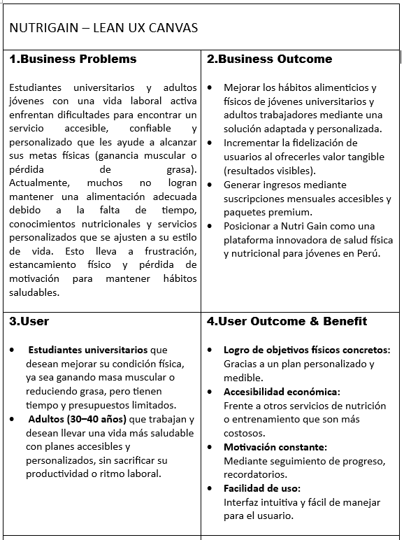

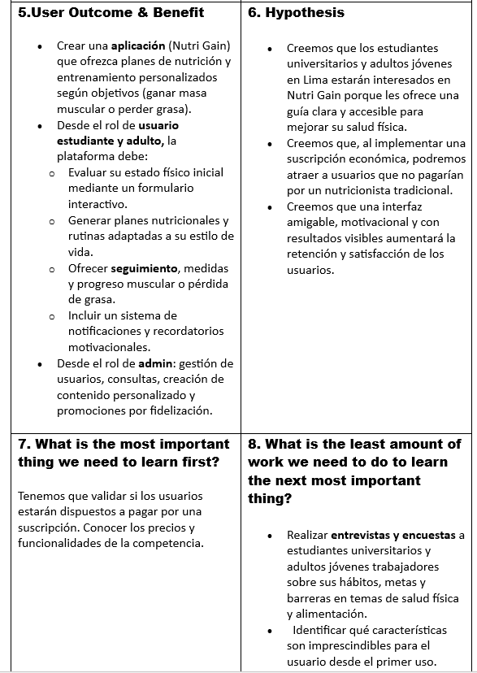


# 1.3. Segmentos objetivo
Nuestro software esta dirigido hacia 2 segmentos objetivos, los cuales son:

- Estudiantes universitarios que desean mejorar su condición física:
Jóvenes de entre 18 y 25 años, en su mayoría universitarios, que buscan incorporar hábitos saludables en su estilo de vida. Buscan soluciones prácticas, entretenidas y accesibles que se adapten a su ritmo académico. Valoran la gamificación, la personalización y la posibilidad de entrenar desde casa o el gimnasio universitario.

- Adultos (30–40 años) que trabajan y desean llevar una vida más saludable:
Personas entre 30 y 40 años con una rutina laboral estable. Están interesados en mejorar su salud física y mental mediante entrenamientos eficientes y planes de alimentación. Valoran la practicidad, la orientación clara y los resultados medibles en poco tiempo.

# Capítulo II : Requirements Elicitation & Analysis 	

## 2.1 Competidores

Se ha identificado a Noom, Peloton y FitnessPal como los principales competidores de nuestro proyecto. Este reconocimiento nos brinda una comprensión más clara del panorama del mercado, permitiéndonos evaluar nuestras fortalezas y debilidades frente a ellos. Contar con esta información será clave para diseñar estrategias y acciones efectivas dentro del sector elegido.

### 2.1.1 Análisis competitivo

<table>
  <tr>
    <th colspan="7" valign="top"><b>Competitive Analysis</b></th>
  </tr>
  <tr>
    <td colspan="2" rowspan="2">Objetivo del análisis</td>
    <td colspan="5">¿De qué forma mi competencia evalúa el mercado, crea sus soluciones y se posiciona frente a las dinámicas del sector?</td>
  </tr>
  <tr>
    <td colspan="5">Este análisis se llevó a cabo con el propósito de identificar a nuestros posibles competidores y desarrollar estrategias y tácticas que nos permitan diferenciarnos de ellos.</td>
  </tr>
  <tr>
    <td colspan="3">Nombre y logo</td>
    <td colspan="1" valign="top" style="font-weight: bold;">
        NutriGain
        <br>
        <div style="text-align: center; margin-top: 10px;">
                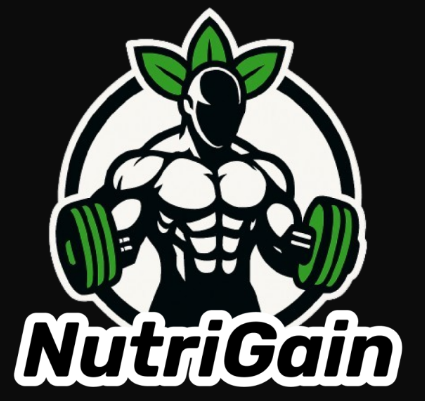
        </div>
    <td colspan="1" valign="top" style="font-weight: bold;">
      Noom
        <div style="text-align: center; margin-top: 10px;">
                
        </div>
    </td>
    <td colspan="1" valign="top" style="font-weight: bold;">
      Peloton
        <div style="text-align: center; margin-top: 10px;">
                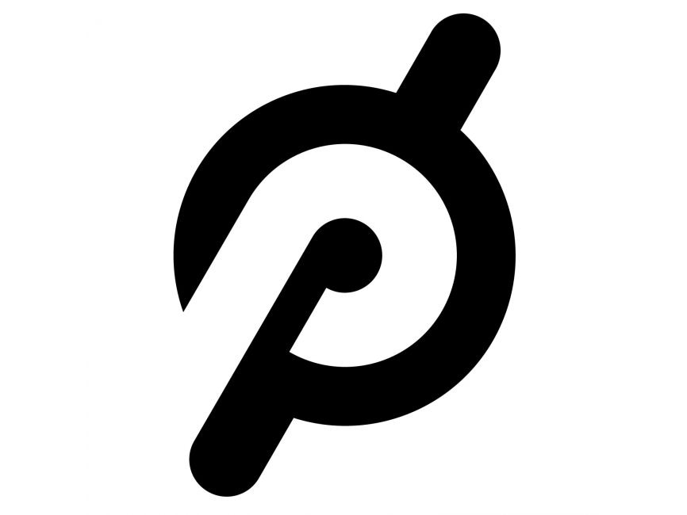
            </div>
        </td>
    <td colspan="1" valign="top" style="font-weight: bold;" >
      MyFitnessPal
        <div style="text-align: center; margin-top: 10px;">
                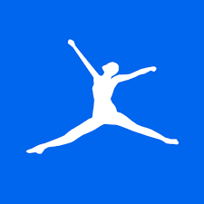
        </div>
    </td>
  </tr>
  <tr>
    <td colspan="1" rowspan="2"><p>Perfil</p></td>
    <td colspan="2">Overview</td>
    <td colspan="1" valign="top">Plataforma web que vincula a personas que desean mantenerse activas y llevar una dieta equilibrada con nutriólogos y entrenadores profesionales.</td>
    <td colspan="1" valign="top">Plataforma web que integra tecnología y acompañamiento personalizado para guiar a los usuarios en la adopción de hábitos saludables relacionados con la nutrición, la actividad física y la salud mental.</td>
    <td colspan="1" valign="top">Plataforma web que ofrece acceso a una amplia gama de clases de fitness tanto en vivo como a demanda, incluyendo sesiones de ciclismo, running, yoga y otras disciplinas.</td>
    <td colspan="1" valign="top">Plataforma web que facilita a los usuarios el monitoreo detallado de su alimentación y rutina de ejercicios, permitiéndoles seguir su progreso físico a lo largo del tiempo.</td>
  </tr>
  <tr>
    <td colspan="2">Ventaja competitiva</td>
    <td colspan="1" valign="top">Brinda a los usuarios la posibilidad de obtener recomendaciones personalizadas y planes diseñados para alcanzar sus metas de salud y acondicionamiento físico. Con funciones complementarias como el seguimiento del progreso, el registro de alimentos y el acceso a contenido exclusivo, nuestra plataforma ofrece una experiencia completa que impulsa a los usuarios a lograr sus objetivos de bienestar de forma efectiva y duradera.</td>
    <td colspan="1" valign="top">Facilita a los usuarios la creación de hábitos saludables a medida con el respaldo de entrenadores expertos, promoviendo cambios de comportamiento positivos y sostenibles a largo plazo.</td>
    <td colspan="1" valign="top">Ofrece acceso a una extensa gama de clases de fitness en vivo y a demanda desde la comodidad del hogar, brindando una experiencia interactiva y motivadora para los usuarios.</td>
    <td colspan="1" valign="top">Facilita un seguimiento detallado de la dieta y el ejercicio, proporcionando una amplia base de datos de alimentos y ejercicios para ayudar a los usuarios a lograr sus metas de salud y acondicionamiento físico con mayor precisión y eficacia.</td>
  </tr>
  <tr>
    <td colspan="1" rowspan="2"><p>Perfil de Marketing</p></td>
    <td colspan="2">Mercado objetivo</td>
    <td colspan="1" valign="top">Personas de entre 18 y 65 años que desean mejorar su salud y estado físico mediante una combinación de ejercicio, nutrición balanceada y orientación profesional.</td>
    <td colspan="1" valign="top">Personas de entre 18 y 65 años que desean crear hábitos saludables personalizados y contar con el apoyo de entrenadores expertos para lograr cambios de comportamiento positivos y sostenibles a largo plazo.</td>
    <td colspan="1" valign="top">Personas de entre 18 y 65 años que quieren acceder a una amplia gama de clases de fitness en vivo y a demanda desde la comodidad de su hogar, buscando una experiencia interactiva y motivadora para mejorar su estado físico.</td>
    <td colspan="1" valign="top">Personas de entre 18 y 65 años interesadas en monitorear detalladamente su dieta y ejercicio, utilizando una amplia base de datos de alimentos y ejercicios para lograr sus objetivos de salud y acondicionamiento físico de manera precisa y efectiva.</td>
  </tr>
  <tr>
    <td colspan="2">Estrategias de marketing</td>
    <td colspan="1" valign="top">Nutrigain establece alianzas con influencers locales en los sectores de fitness, nutrición o bienestar para promocionar su aplicación. Estos influencers cuentan con audiencias comprometidas y específicas, lo que permite llegar de manera más directa a un público objetivo.</td>
    <td colspan="1" valign="top">Proporcionan contenido valioso creando y compartiendo artículos, videos y recursos relacionados con la salud, el fitness y la nutrición a través de sus canales digitales.</td>
    <td colspan="1" valign="top">Brindan una extensa gama de clases de fitness en vivo y a demanda a través de su plataforma.</td>
    <td colspan="1" valign="top">Permiten a sus usuarios compartir sus logros y avances en las redes sociales utilizando el hashtag oficial de la marca.</td>
  </tr>
  <tr>
    <td colspan="1" rowspan="3"><p>Perfil de Producto</p></td>
    <td colspan="2">Productos & Servicios</td>
    <td colspan="1" valign="top">Brinda a los usuarios la posibilidad de conectarse con nutriólogos y entrenadores especializados en salud y fitness.

Ofrece recomendaciones personalizadas basadas en los objetivos individuales de cada usuario, como perder peso, tonificar músculos o ganar masa muscular, entre otros.

Permite a los usuarios monitorear su progreso a lo largo del tiempo, ya sea en términos de peso, medidas, hábitos alimenticios o desempeño en ejercicios.

Facilita la conexión con nutriólogos, entrenadores independientes y gimnasios locales, donde los usuarios pueden recibir apoyo adicional y realizar sus entrenamientos.
    </td>
    <td colspan="1" valign="top">Brinda coaching personalizado que combina tecnología avanzada con asesoramiento humano para apoyar a los usuarios en el desarrollo de hábitos saludables.

Ofrece herramientas y recursos para la planificación de comidas, incluyendo recetas saludables y recomendaciones de alimentos.

Permite a los usuarios monitorear su progreso en cuanto a pérdida de peso, actividad física y hábitos alimenticios a lo largo del tiempo.</td>
    <td colspan="1" valign="top">Brinda una amplia variedad de clases de fitness en vivo y a demanda, que incluyen ciclismo, carrera, yoga y otras disciplinas.

Ofrece equipos de ejercicio en casa, como bicicletas estáticas y cintas de correr, para proporcionar una experiencia de entrenamiento completa.

Promueve la participación de la comunidad mediante eventos virtuales, grupos de apoyo y desafíos de fitness, manteniendo a los usuarios motivados y comprometidos.</td>
    <td colspan="1" valign="top">Permite a los usuarios monitorear detalladamente su consumo de alimentos y actividad física, proporcionando datos y análisis para ayudarles a alcanzar sus metas de salud y acondicionamiento físico.

Ofrece una extensa base de datos de alimentos que facilita a los usuarios encontrar y registrar información nutricional precisa sobre sus comidas.

Cuenta con una comunidad activa en línea donde los usuarios pueden compartir sus logros, recibir apoyo y motivación de otros miembros.</td>
  </tr>
  <tr>
      <td colspan="2">Precios & Costos</td>
      <td colspan="1" valign="top">Test Plan: S/.0

Monthly Plan: S/.19.90

Annual Plan: S/.249.90</td>
      <td colspan="1" valign="top">Periodo de prueba (7 a 14 días): $0.50 hasta $18.

Plan mensual con renovación automática: $70 USD por mes.

Plan anual con renovación automática: $17.50 USD por mes.</td>
      <td colspan="1" valign="top">Los precios pueden incluir el costo inicial del equipo (como bicicletas estáticas o cintas de correr), además de una tarifa mensual de suscripción que generalmente es de $39 al mes para obtener acceso completo a clases y contenido exclusivo.</td>
      <td colspan="1" valign="top">Free: $0 (seguimiento de la dieta y el ejercicio).

Premium: $19.99 mensual.</td>
  </tr>
  <tr>
    <td colspan="2">Canales de distribución (Web y/o Móvil)</td>
    <td colspan="1" valign="top">Redes sociales y aplicación web</td>
    <td colspan="1" valign="top">Página web y aplicación móvil</td>
    <td colspan="1" valign="top">Página web y aplicación móvil</td>
    <td colspan="1" valign="top">Página web y aplicación móvil</td>
  </tr>
  <tr>
    <td colspan="1" rowspan="5"><p>Análisis SWOT</p></td>
    <td colspan="6">Elabore este análisis para su startup y sus competidores. Las fortalezas de su empresa deben potenciar las oportunidades del mercado y contribuir a lo que usted define como su ventaja competitiva.</td>
  </tr>
  <tr>
    <td colspan="2">Fortalezas</td>
    <td colspan="1" valign="top">Vinculación directa con nutriólogos y entrenadores.</td>
    <td colspan="1" valign="top">Proporciona sugerencias y monitoreo personalizados basados en la información del usuario.</td>
    <td colspan="1" valign="top">Comunidad activa y dedicada.</td>
    <td colspan="1" valign="top">La combinación de tecnología con soporte humano crea una ventaja competitiva al proporcionar un enfoque más individualizado.</td>
  </tr>
  <tr>
    <td colspan="2">Debilidades</td>
    <td colspan="1" valign="top"> Los competidores establecidos pueden tener una base de usuarios sólida, lo que dificulta la captación de nuevos usuarios.</td>
    <td colspan="1" valign="top">Si la infraestructura no está diseñada para crecer rápidamente, podría haber problemas al expandir el número de usuarios o funcionalidades.</td>
    <td colspan="1" valign="top">Si la personalización de las recomendaciones no es lo suficientemente precisa, los usuarios pueden no encontrar valor en la aplicación.</td>
    <td colspan="1" valign="top">Conseguir nuevos usuarios puede ser costoso si no se cuenta con una estrategia efectiva de marketing o visibilidad en el mercado.</td>
  </tr>
  <tr>
    <td colspan="2">Oportunidades</td>
    <td colspan="1" valign="top">La creciente conciencia sobre la salud y el bienestar ofrece una oportunidad para capturar una mayor cuota de mercado.</td>
    <td colspan="1" valign="top">Incorporar tecnologías avanzadas, como inteligencia artificial, puede mejorar la personalización de la plataforma.</td>
    <td colspan="1" valign="top">Colaborar con marcas locales, influencers y gimnasios puede ampliar el alcance de la startup.</td>
    <td colspan="1" valign="top">Conexión con dispositivos de fitness populares, como Fitbit o Garmin, para ofrecer a los usuarios una experiencia más integral y adaptada a sus necesidades.</td>
  </tr>
  <tr>
    <td colspan="2">Amenazas</td>
    <td colspan="1" valign="top">La aparición de nuevas aplicaciones o plataformas con características similares puede aumentar la presión en el mercado y dificultar la captación de usuarios.</td>
    <td colspan="1" valign="top">Los intereses y necesidades de los usuarios pueden cambiar rápidamente, lo que obliga a las plataformas a adaptarse constantemente para mantener la relevancia.</td>
    <td colspan="1" valign="top">La creciente preocupación por la privacidad de los datos y las regulaciones en torno a la protección de la información personal pueden generar desafíos en términos de cumplimiento y confianza del usuario.</td>
    <td colspan="1" valign="top">Cualquier interrupción en el servicio o fallos técnicos pueden dañar la reputación de la aplicación y disminuir la satisfacción de los usuarios.</td>
  </tr>
</table>

### 2.1.2 Estrategias y tácticas frente a competidores

Nuestro objetivo principal es ofrecer una experiencia de usuario superior que nos distinga claramente de la competencia. Aspiramos a que nuestra aplicación sea intuitiva, visualmente atractiva y cargada de funciones útiles que superen las expectativas del usuario.

Pondremos en valor las características diferenciadoras de nuestra app, destacando un enfoque personalizado en la interacción entre los usuarios y los profesionales de la salud. Además, incluiremos contenido exclusivo y tecnología de vanguardia. Nuestra aplicación estará diseñada para adaptarse a las necesidades particulares de cada usuario, brindando recomendaciones personalizadas y ajustes basados en los datos recolectados, mediante algoritmos avanzados y una retroalimentación constante por parte de los usuarios.

Para fortalecer nuestra presencia y credibilidad, estableceremos alianzas con influencers, nutriólogos reconocidos y entrenadores personales, además de organizar eventos de lanzamiento y colaboraciones estratégicas que generen confianza e interés en nuestra marca. Escuchar activamente a nuestros usuarios y responder a sus comentarios será clave para ofrecer un servicio al cliente excepcional, lo cual no solo fomentará la lealtad de nuestros usuarios actuales, sino que también atraerá a nuevos clientes hacia nuestra plataforma.

## 2.2 Entrevistas 

El objetivo de realizar entrevistas es comprender a fondo las experiencias, puntos de vista y opiniones de los segmentos de mercado elegidos. Buscamos recolectar información relevante que nos permita conocer mejor a nuestro público objetivo y profundizar en el entendimiento de los usuarios. A través de estas conversaciones, podremos identificar con mayor claridad sus necesidades y deseos, lo que facilitará la adaptación de nuestros productos o servicios para responder de forma más adecuada a sus expectativas.

### 2.2.1 Diseño de entrevistas

interesados en mejorar su salud y condición física:

¿Qué razones te han impulsado recientemente a buscar formas de mejorar tu bienestar físico y tu salud?

¿Cómo ha sido tu experiencia en el pasado al intentar llevar un estilo de vida más saludable? ¿Qué dificultades has encontrado en el camino?

¿Qué tipo de guía o acompañamiento consideras que te sería más útil para alcanzar tus metas relacionadas con la salud y la forma física?

¿De qué manera crees que una aplicación web de coaching online podría ayudarte a mantener la motivación y el compromiso con tus objetivos de bienestar?

¿Qué funcionalidades considerarías esenciales al momento de elegir un servicio de coaching en línea enfocado en la salud y el acondicionamiento físico?

¿Qué tipo de apoyo y seguimiento esperarías recibir de un coach profesional en tu camino hacia un estilo de vida más sano?

### 2.2.2 Registro de entrevistas 

Nombre y apellidos: Angel Fabian <br>
Edad: 19 <br>

[URL para ir a la entrevista](https://upcedupe-my.sharepoint.com/:v:/g/personal/u202219266_upc_edu_pe/EWENlAEPxZJHmqZvxuDqO0MBD3zQxxkQnChG0q1x3q6OBA?e=iGpgaj&nav=eyJyZWZlcnJhbEluZm8iOnsicmVmZXJyYWxBcHAiOiJTdHJlYW1XZWJBcHAiLCJyZWZlcnJhbFZpZXciOiJTaGFyZURpYWxvZy1MaW5rIiwicmVmZXJyYWxBcHBQbGF0Zm9ybSI6IldlYiIsInJlZmVycmFsTW9kZSI6InZpZXcifX0%3D)


<br>

**Resumen de la entrevista:** <td> El entrevistado nos cuenta sobre qué lo motivó a mejorar su salud y condición física. Esto porque quería mejorar su aspecto físico y no tener que comprar ropa ancha.
También cuenta qué experiencias y obstáculos tuvo al adoptar este nuevo estilo de vida saludable.
Finalmente nos cuenta que lo que espera de un coach es que lo incentive dándole metas y apoyo con las rutinas y la alimentación.
 </td>

### 2.2.3 Análisis de entrevistas

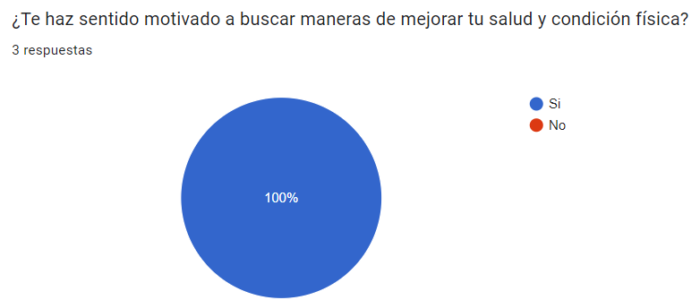
<br><br>
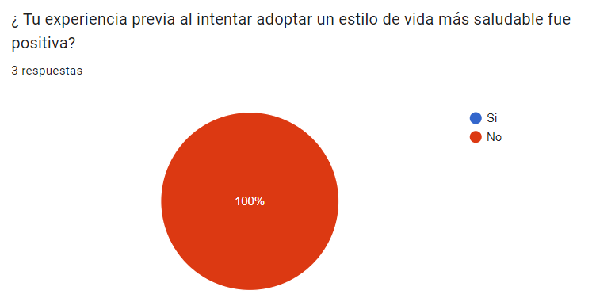
<br><br>
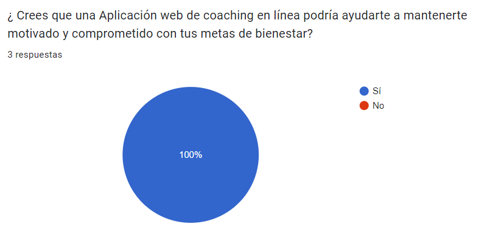
<br><br>
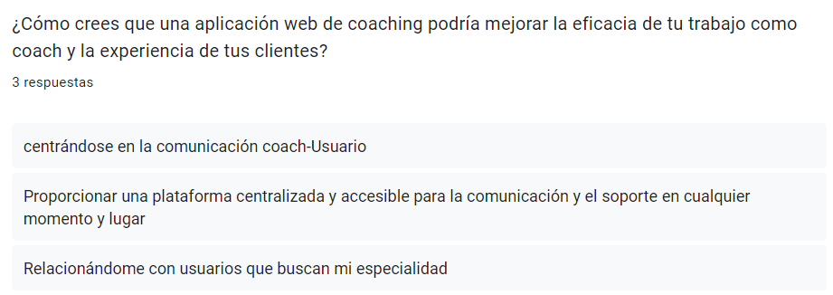
<br><br>

## 2.3 Needfinding 

### 2.3.1 User Personas

**Segmento 1: Estudiantes universitarios que desean mejorar su condición física**


**Segmento 2: Adultos jóvenes (30–40 años) que trabajan y desean llevar una vida más saludable**


### 2.3.2 User Task Matrix

<table align="center" border="1" width="90%" style="text-align:center;">
    <tr>
        <td>User Task Matrix</td>
        <td colspan=2>
            Usuarios interesados en mejorar su salud y estado físico
        </td>
        <td colspan=2>
            Profesionales de la salud y el fitness
        </td>
    </tr>
    <tr>
        <td>
        </td>
        <td>
            <b>Frequency</b>
        </td>
        <td>
            <b>Importance</b>
        </td>
        <td>
            <b>Frequency</b>
        </td>
        <td>
            <b>Importance</b>
        </td>
    </tr>
    <tr>
        <td>
            Definir metas relacionadas con la salud y el acondicionamiento físico.
        </td>
        <td>
            Alta
        </td>
        <td>
            Siempre
        </td>
        <td>
            Alta
        </td>
        <td>
            Baja
        </td>
    </tr>
    <tr>
        <td>
            Explorar y establecer contacto con nutriólogos y entrenadores personales.
        </td>
        <td>
            Alta
        </td>
        <td>
            Alta
        </td>
        <td>
            Alta
        </td>
        <td>
            Baja
        </td>
    </tr>
    <tr>
        <td>
            Obtener sugerencias personalizadas en cuanto a alimentación y rutinas de ejercicio.
        </td>
        <td>
            Alta
        </td>
        <td>
            A menudo
        </td>
        <td>
            Alta
        </td>
        <td>
            A veces
        </td>
    </tr>
     <tr>
        <td>
            Monitorear el consumo de alimentos y el conteo de calorías.
        </td>
        <td>
            Alta
        </td>
        <td>
            Siempre
        </td>
        <td>
            Alta
        </td>
        <td>
            Baja
        </td>
    </tr>
     <tr>
        <td>
            Llevar un registro de las actividades físicas y los ejercicios efectuados.
        </td>
        <td>
            Alta
        </td>
        <td>
            A menudo
        </td>
        <td>
            Alta
        </td>
        <td>
            A veces
        </td>
    </tr>
     <tr>
        <td>
            Revisar el avance alcanzado en relación con las metas de salud establecidas.
        </td>
        <td>
            Alta
        </td>
        <td>
            Siempre
        </td>
        <td>
            Alta
        </td>
        <td>
            A veces
        </td>
    </tr>
     <tr>
        <td>
            Pedir supervisión y comentarios por parte de los profesionales de la salud.
        </td>
        <td>
            Alta
        </td>
        <td>
            A veces
        </td>
        <td>
            Alta
        </td>
        <td>
            A menudo
        </td>
    </tr>
     <tr>
        <td>
            Configurar recordatorios y alertas para las actividades diarias.
        </td>
        <td>
            Alta
        </td>
        <td>
            A menudo
        </td>
        <td>
            Alta
        </td>
        <td>
            A veces
        </td>
    </tr>
     <tr>
        <td>
            Conectarse y participar con otros usuarios en la comunidad de la aplicación.
        </td>
        <td>
            Alta
        </td>
        <td>
            A menudo
        </td>
        <td>
            Alta
        </td>
        <td>
            A veces
        </td>
    </tr>
     <tr>
        <td>
            Explorar programas de entrenamiento específicos
        </td>
        <td>
            Alta
        </td>
        <td>
            A menudo
        </td>
        <td>
            Alta
        </td>
        <td>
            Baja
        </td>
    </tr>
</table>

### 2.3.3. User Journey Mapping

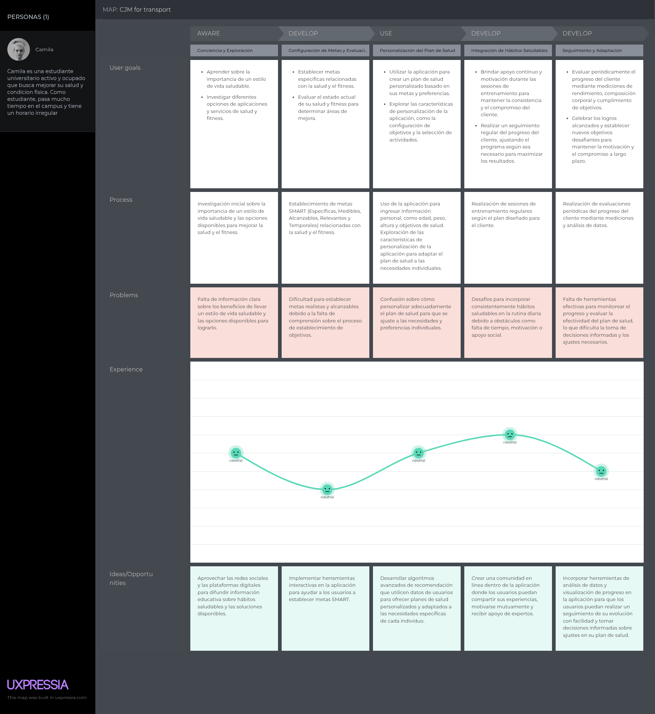
<br><br>

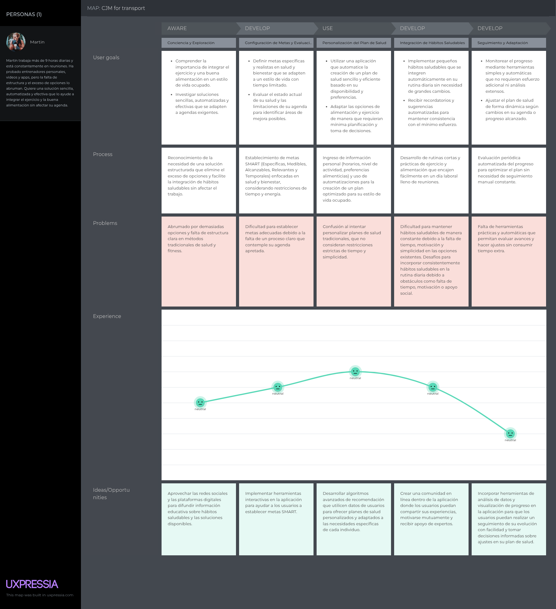
<br><br>

### 2.3.4. Empathy Mapping

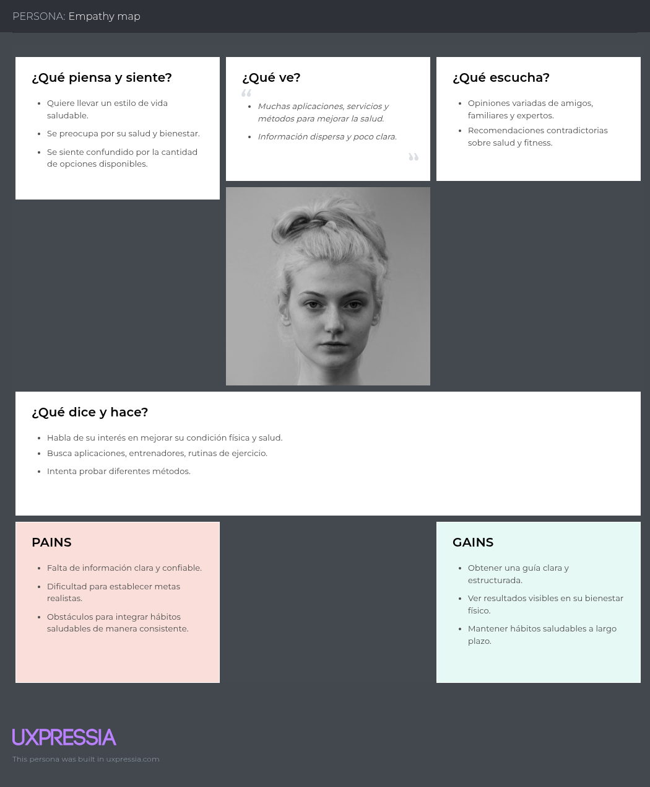

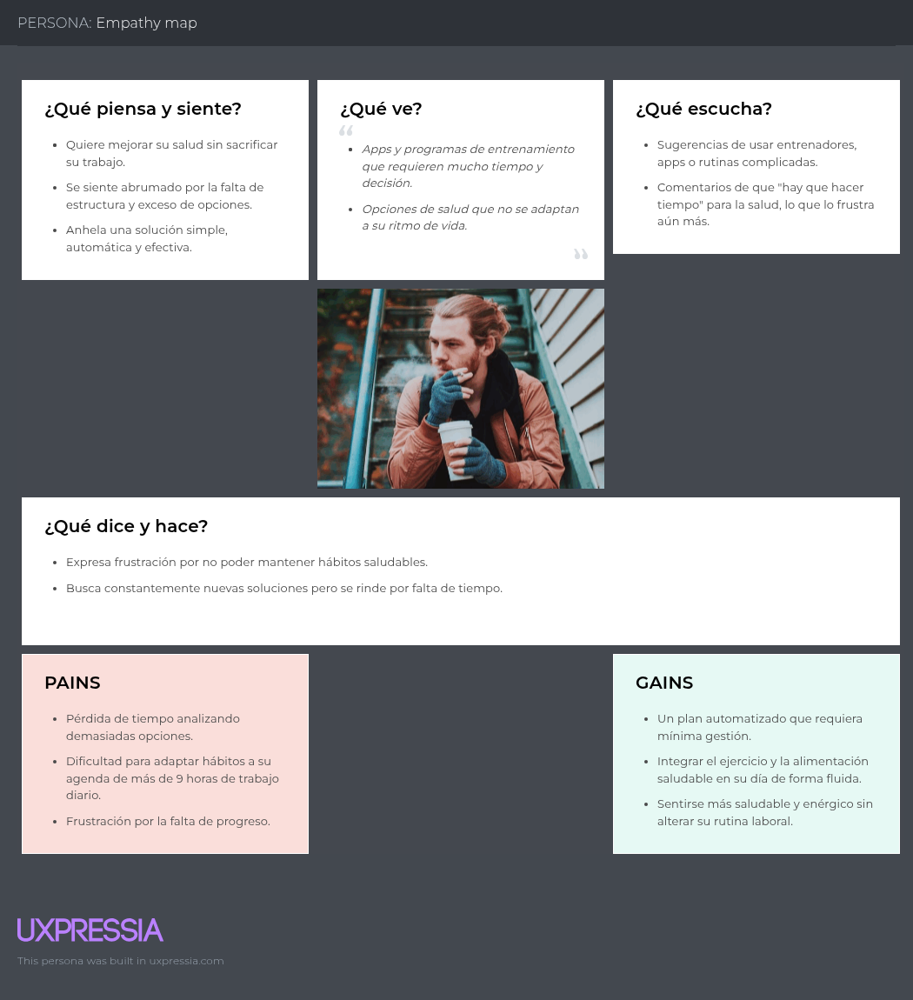

### 2.3.5. As-is Scenario Mapping

Los escenarios actuales (AS-IS) ofrecen una descripción detallada de los pasos, pensamientos y emociones de los usuarios antes de interactuar con el producto. Estos escenarios facilitan la comprensión de sus necesidades y desafíos actuales, lo cual guía al equipo en el diseño de una experiencia más efectiva y centrada en la solución de problemas reales. Al analizar los escenarios actuales, el producto puede desarrollarse de manera que cumpla con las expectativas y ofrezca soluciones alineadas con las experiencias reales de los usuarios, resultando en un producto más exitoso y relevante.

**Segmento 1: Estudiantes universitarios que desean mejorar su condición física**


**Figura 1**  
*As-Is Scenario Mapping para el segmento de estudiantes universitarios*.  
Nota. Elaboración propia basada en el análisis de experiencias futuras proyectadas para la usuaria Camila.


**Segmento 2: Adultos jóvenes (30–40 años) que trabajan y desean llevar una vida más saludable**


**Figura 2**  
*As-Is Scenario Mapping para el segmento de adultos jóvenes que trabajan*.  
Nota. Elaboración propia basada en el análisis de experiencias futuras proyectadas para el usuario Martín.

## 2.4. Ubiquitous Language.

Usuario Persona que se une a NutriGain para ponerse en forma de una manera divertida, con entrenamientos que se adaptan a su vida y a sus intereses.

Camino Fitness Es el camino que el usuario elige al empezar su aventura en NutriGain: ¿quiere ganar músculo, ser más ágil como un atleta o encontrar equilibrio a través del yoga?

Personaje Virtual Es su compañero de viaje: un personaje que no solo anima, sino que también adapta los entrenamientos y la alimentación según cómo va progresando.

Rutina Semanal Es el plan de ejercicios de cada semana, personalizado y actualizado automáticamente para que siempre se ajuste a su nivel, ritmo de vida y metas.

Plan Nutricional Es una guía de comidas pensada para acompañar los entrenamientos, ayudando al usuario a alcanzar resultados de forma equilibrada y realista.

Desafíos Únicos Son mini-retos aleatorios y personalizados que aparecen para mantener la experiencia divertida, desafiante y diferente cada vez.

Reto Extremo Diario Es un desafío especial que cambia todos los días y lleva al usuario a superar sus propios límites, de forma intensa pero motivadora.

Gamificación Son los toques de juego que hacen a NutriGain especial: personajes, niveles, recompensas, desafíos… todo pensado para que entrenar sea algo que se disfrute, no una obligación.

Progreso del Usuario Es el seguimiento constante de cuánto ha mejorado: desde las metas cumplidas, hasta los desafíos ganados y los hábitos mantenidos.

Adaptabilidad Es la magia detrás de NutriGain: todo se ajusta solo —entrenamientos y alimentación— según el avance, los horarios y hasta los cambios de humor del usuario.

Entrenamiento en Casa/Gimnasio Es la libertad de decidir si hoy se entrena en la sala de su casa o en el gimnasio, sin perder calidad ni resultados.

Segmento Estudiante Son jóvenes universitarios que buscan mejorar su salud de manera divertida, fácil de integrar en su vida académica y accesible en cualquier momento.

Segmento Adulto Profesional Son adultos entre 30 y 40 años, trabajadores ocupados que quieren soluciones claras, prácticas y que realmente den resultados sin complicar su rutina diaria.

# Capítulo III: Requirements Specification
## 3.1. To-Be Scenario Mapping

Se presenta el análisis de los distintos escenarios, estructurando una tabla que especifica la situación que requiere mejora para el segmento objetivo. Se analizan las acciones a realizar y se explica la forma en que estas son interpretadas.

**Segmento 1: Estudiantes universitarios que desean mejorar su condición física**


**Figura 1**  
*To-Be Scenario Mapping para el segmento de estudiantes universitarios*.  
Nota. Elaboración propia basada en el análisis de experiencias futuras proyectadas para la usuaria Camila.


**Segmento 2: Adultos jóvenes (30–40 años) que trabajan y desean llevar una vida más saludable**


**Figura 2**  
*To-Be Scenario Mapping para el segmento de adultos jóvenes que trabajan*.  
Nota. Elaboración propia basada en el análisis de experiencias futuras proyectadas para el usuario Martín.

## 3.2. User Stories

<table>
  <thead>
    <tr>
      <th>Epic / Story ID</th>
      <th>Título</th>
      <th>Descripción</th>
      <th>Criterios de Aceptación</th>
      <th>Relacionado con (Epic ID)</th>
    </tr>
  </thead>
  <tbody>
    <tr>
      <td>US01</td>
      <td>Elección de camino fitness</td>
      <td>Como estudiante sin experiencia en entrenamiento, quiero elegir un camino fitness personalizado, para poder iniciar una rutina adecuada a mis metas.</td>
      <td><strong>Dado que</strong> el usuario ha creado una cuenta, <strong>Cuando</strong> accede por primera vez, <strong>Luego</strong> podrá seleccionar uno de los caminos fitness disponibles.</td>
      <td>EP-01</td>
    </tr>
    <tr>
      <td>US02</td>
      <td>Acompañamiento virtual</td>
      <td>Como estudiante usuaria de la app, quiero que un personaje virtual me acompañe en mi progreso, para sentirme motivada a seguir entrenando cada semana.</td>
      <td><strong>Dado que</strong> el usuario ha elegido un camino, <strong>Cuando</strong> avance en su progreso semanal, <strong>Luego</strong> el avatar evolucionará y mostrará mensajes de motivación.</td>
      <td>EP-02</td>
    </tr>
    <tr>
      <td>US03</td>
      <td>Visualización de progreso</td>
      <td>Como estudiante que busca tonificarse, quiero ver mis avances semanales mediante gráficos, para tener visibilidad clara de mi progreso.</td>
      <td><strong>Dado que</strong> el usuario completa sesiones, <strong>Cuando</strong> revise la sección de progreso, <strong>Luego</strong> visualizará gráficas actualizadas con sus avances.</td>
      <td>EP-03</td>
    </tr>
    <tr>
      <td>US04</td>
      <td>Plan nutricional personalizado</td>
      <td>Como usuaria con poco conocimiento nutricional, quiero recibir un plan nutricional basado en mis preferencias, para alimentarme mejor sin complicaciones.</td>
      <td><strong>Dado que</strong> el usuario completa su perfil alimenticio, <strong>Cuando</strong> accede al plan nutricional, <strong>Luego</strong> recibirá un menú personalizado con recomendaciones.</td>
      <td>EP-04</td>
    </tr>
    <tr>
      <td>US05</td>
      <td>Retos semanales aleatorios</td>
      <td>Como estudiante con rutinas monótonas previas, quiero recibir retos semanales aleatorios, para mantenerme motivada y evitar el aburrimiento.</td>
      <td><strong>Dado que</strong> inicia una nueva semana, <strong>Cuando</strong> entra a la app, <strong>Luego</strong> recibirá un reto semanal adaptado a su nivel.</td>
      <td>EP-05</td>
    </tr>
    <tr>
      <td>US06</td>
      <td>Plan semanal adaptado al tiempo</td>
      <td>Como adulto con poco tiempo disponible, quiero recibir un plan semanal de ejercicios adaptado a mi rutina laboral, para poder entrenar sin afectar mi horario de trabajo.</td>
      <td><strong>Dado que</strong> el usuario tiene tiempo limitado, <strong>Cuando</strong> configure sus preferencias, <strong>Luego</strong> el plan semanal se ajustará a su disponibilidad.</td>
      <td>EP-01</td>
    </tr>
    <tr>
      <td>US07</td>
      <td>Registro de progreso físico y nutricional</td>
      <td>Como profesional que desea llevar una vida saludable, quiero registrar fácilmente mis avances físicos y nutricionales, para tener seguimiento y constancia.</td>
      <td><strong>Dado que</strong> el usuario registra sus datos, <strong>Cuando</strong> consulte su evolución, <strong>Luego</strong> podrá visualizar estadísticas de progreso físico y nutricional.</td>
      <td>EP-03</td>
    </tr>
    <tr>
      <td>US08</td>
      <td>Motivación constante</td>
      <td>Como adulto que se desmotiva fácilmente, quiero recibir mensajes de motivación del personaje virtual, para mantenerme enfocado en mis metas.</td>
      <td><strong>Dado que</strong> el usuario complete objetivos, <strong>Cuando</strong> interactúe con su avatar, <strong>Luego</strong> recibirá mensajes motivacionales personalizados.</td>
      <td>EP-02</td>
    </tr>
    <tr>
      <td>US09</td>
      <td>Acceso al camino en plan gratuito</td>
      <td>Como usuario del plan gratuito, quiero poder probar un camino fitness completo antes de pagar, para evaluar si la app me funciona antes de suscribirme.</td>
      <td><strong>Dado que</strong> el usuario está en plan gratuito, <strong>Cuando</strong> inicia la app, <strong>Luego</strong> podrá acceder a un camino completo pero con funciones limitadas.</td>
      <td>EP-06</td>
    </tr>
    <tr>
      <td>US10</td>
      <td>Cambio de camino en plan premium</td>
      <td>Como usuario premium, quiero poder cambiar de camino fitness en cualquier momento, para adaptar mi entrenamiento a mis nuevas metas o intereses.</td>
      <td><strong>Dado que</strong> el usuario tiene plan premium, <strong>Cuando</strong> desee cambiar de camino, <strong>Luego</strong> podrá hacerlo desde la configuración de perfil sin restricciones.</td>
      <td>EP-06</td>
    </tr>
    <tr>
      <td>US11</td>
      <td>Gestión de perfil de usuario</td>
      <td>Como usuario registrado, quiero editar mi información personal y preferencias, para mantener mi perfil actualizado según mis objetivos.</td>
      <td><strong>Dado que</strong> el usuario ha iniciado sesión, <strong>Cuando</strong> accede a su perfil, <strong>Luego</strong> podrá editar y guardar su información personal.</td>
      <td>EP-06</td>
    </tr>
    <tr>
      <td>US12</td>
      <td>Visualización de logros alcanzados</td>
      <td>Como usuario, quiero ver los logros que he desbloqueado, para sentirme motivado a continuar usando la app.</td>
      <td><strong>Dado que</strong> el usuario completa objetivos, <strong>Cuando</strong> consulte su perfil, <strong>Luego</strong> visualizará logros alcanzados y próximos por cumplir.</td>
      <td>EP-02</td>
    </tr>
    <tr>
      <td>US13</td>
      <td>Notificaciones de actividad diaria</td>
      <td>Como usuario con poca constancia, quiero recibir notificaciones diarias sobre mis rutinas y planes, para mantenerme enfocado en mi progreso.</td>
      <td><strong>Dado que</strong> el usuario tiene planes activos, <strong>Cuando</strong> llegue la hora programada, <strong>Luego</strong> recibirá una notificación sobre su actividad pendiente.</td>
      <td>EP-02</td>
    </tr>
    <tr>
      <td>US14</td>
      <td>Evaluación de bienestar semanal</td>
      <td>Como usuario, quiero completar un cuestionario semanal sobre mi bienestar, para recibir recomendaciones más personalizadas.</td>
      <td><strong>Dado que</strong> finaliza la semana, <strong>Cuando</strong> complete el cuestionario de bienestar, <strong>Luego</strong> la app ajustará sugerencias en base a sus respuestas.</td>
      <td>EP-03</td>
    </tr>
    <tr>
      <td>US15</td>
      <td>Soporte técnico básico para usuarios</td>
      <td>Como usuario que enfrenta dificultades técnicas, quiero acceder a una sección de ayuda o soporte, para resolver problemas rápidamente.</td>
      <td><strong>Dado que</strong> el usuario reporta un problema, <strong>Cuando</strong> accede a la sección de soporte, <strong>Luego</strong> podrá ver respuestas frecuentes o contactar asistencia.</td>
      <td>EP-06</td>
    </tr>
    <tr>
    <td>US16</td>
    <td>Visualización de secciones clave</td>
    <td>Como visitante del sitio web, quiero visualizar de forma clara las secciones "About the app", "Paths", "Pricing" y "About us", para entender la app fácilmente.</td>
    <td><strong>Dado que</strong> accedo a la landing page, <strong>Cuando</strong> navego entre secciones, <strong>Luego</strong> puedo ver cada bloque con información diferenciada y comprensible.</td>
    <td>EP-06</td>
    </tr>
    <tr>
    <td>US17</td>
    <td>Botón CTA (Call To Action)</td>
    <td>Como visitante, quiero ver un botón llamativo para registrarme o iniciar sesión, para empezar a usar la app de forma rápida.</td>
    <td><strong>Dado que</strong> estoy en la landing page, <strong>Cuando</strong> visualizo el header, <strong>Luego</strong> veo un botón destacado "Get Started" que me lleva al registro/login.</td>
    <td>EP-06</td>
    </tr>
    <tr>
    <td>US18</td>
    <td>Visualización de los caminos (Paths)</td>
    <td>Como visitante, quiero ver los distintos caminos de entrenamiento (Aesthetic, Sports, Yoga), para elegir el que mejor se adapte a mis objetivos.</td>
    <td><strong>Dado que</strong> navego a la sección "Paths", <strong>Cuando</strong> leo la información y veo las imágenes, <strong>Luego</strong> puedo entender la diferencia entre cada tipo de camino.</td>
    <td>EP-01</td>
    </tr>
    <tr>
    <td>US19</td>
    <td>Información sobre la app</td>
    <td>Como visitante, quiero entender qué hace diferente a NutriGain, para saber si me interesa registrarme.</td>
    <td><strong>Dado que</strong> accedo a la sección "About the app", <strong>Cuando</strong> leo su contenido, <strong>Luego</strong> puedo entender sus funcionalidades principales.</td>
    <td>EP-06</td>
    </tr>
    <tr>
    <td>US20</td>
    <td>Visualización del equipo</td>
    <td>Como visitante, quiero conocer a las personas detrás de la app, para confiar más en el producto.</td>
    <td><strong>Dado que</strong> accedo a la sección "About us", <strong>Cuando</strong> visualizo las tarjetas del equipo, <strong>Luego</strong> puedo ver sus nombres, roles e imágenes.</td>
    <td>EP-06</td>
    </tr>
  </tbody>
</table>

## 3.3. Impact Mapping

En este apartado se muestra los impact mapping de nuestros segmentos objetivos:

**Segmento 1: Estudiantes universitarios que desean mejorar su condición física**


**Figura 3**  
*Impact Mapping para el segmento de estudiantes universitarios que desean mejorar su condición física*.  
Nota. Elaboración propia basada en el objetivo de negocio, impactos, entregables y User Story asociada a la usuaria Camila.


**Segmento 2: Adultos jóvenes (30–40 años) que trabajan y desean llevar una vida más saludable**


**Figura 4**  
*Impact Mapping para el segmento de adultos jóvenes (30–40 años) que trabajan y desean una vida más saludable*.  
Nota. Elaboración propia basada en el objetivo de negocio, impactos, entregables y User Story asociada al usuario Martín.

## 3.4. Product Backlog

<table>
  <thead>
    <tr>
      <th># Orden</th>
      <th>User Story Id</th>
      <th>Título</th>
      <th>Descripción</th>
      <th>Story Points (1 / 2 / 3 / 5 / 8)</th>
    </tr>
  </thead>
  <tbody>
    <tr>
    <td>1</td>
    <td>US01</td>
    <td>Elección de camino fitness</td>
    <td>Como estudiante sin experiencia en entrenamiento, quiero elegir un camino fitness personalizado, para poder iniciar una rutina adecuada a mis metas.</td>
    <td>3</td>
    </tr>
    <tr>
    <td>2</td>
    <td>US09</td>
    <td>Acceso al camino en plan gratuito</td>
    <td>Como usuario del plan gratuito, quiero poder probar un camino fitness completo antes de pagar, para evaluar si la app me funciona antes de suscribirme.</td>
    <td>3</td>
    </tr>
    <tr>
    <td>3</td>
    <td>US04</td>
    <td>Plan nutricional personalizado</td>
    <td>Como usuaria con poco conocimiento nutricional, quiero recibir un plan nutricional basado en mis preferencias, para alimentarme mejor sin complicaciones.</td>
    <td>5</td>
    </tr>
    <tr>
    <td>4</td>
    <td>US06</td>
    <td>Plan semanal adaptado al tiempo</td>
    <td>Como adulto con poco tiempo disponible, quiero recibir un plan semanal de ejercicios adaptado a mi rutina laboral, para poder entrenar sin afectar mi horario de trabajo.</td>
    <td>3</td>
    </tr>
    <tr>
    <td>5</td>
    <td>US02</td>
    <td>Acompañamiento virtual</td>
    <td>Como estudiante usuaria de la app, quiero que un personaje virtual me acompañe en mi progreso, para sentirme motivada a seguir entrenando cada semana.</td>
    <td>3</td>
    </tr>
    <tr>
    <td>6</td>
    <td>US05</td>
    <td>Retos semanales aleatorios</td>
    <td>Como estudiante con rutinas monótonas previas, quiero recibir retos semanales aleatorios, para mantenerme motivada y evitar el aburrimiento.</td>
    <td>3</td>
    </tr>
    <tr>
    <td>7</td>
    <td>US03</td>
    <td>Visualización de progreso</td>
    <td>Como estudiante que busca tonificarse, quiero ver mis avances semanales mediante gráficos, para tener visibilidad clara de mi progreso.</td>
    <td>2</td>
    </tr>
    <tr>
    <td>8</td>
    <td>US14</td>
    <td>Evaluación de bienestar semanal</td>
    <td>Como usuario, quiero completar un cuestionario semanal sobre mi bienestar, para recibir recomendaciones más personalizadas.</td>
    <td>3</td>
    </tr>
    <tr>
    <td>9</td>
    <td>US13</td>
    <td>Notificaciones de actividad diaria</td>
    <td>Como usuario con poca constancia, quiero recibir notificaciones diarias sobre mis rutinas y planes, para mantenerme enfocado en mi progreso.</td>
    <td>2</td>
    </tr>
    <tr>
    <td>10</td>
    <td>US08</td>
    <td>Motivación constante</td>
    <td>Como adulto que se desmotiva fácilmente, quiero recibir mensajes de motivación del personaje virtual, para mantenerme enfocado en mis metas.</td>
    <td>2</td>
    </tr>
    <tr>
    <td>11</td>
    <td>US07</td>
    <td>Registro de progreso físico y nutricional</td>
    <td>Como profesional que desea llevar una vida saludable, quiero registrar fácilmente mis avances físicos y nutricionales, para tener seguimiento y constancia.</td>
    <td>2</td>
    </tr>
    <tr>
    <td>12</td>
    <td>US10</td>
    <td>Cambio de camino en plan premium</td>
    <td>Como usuario premium, quiero poder cambiar de camino fitness en cualquier momento, para adaptar mi entrenamiento a mis nuevas metas o intereses.</td>
    <td>2</td>
    </tr>
    <tr>
    <td>13</td>
    <td>US11</td>
    <td>Gestión de perfil de usuario</td>
    <td>Como usuario registrado, quiero editar mi información personal y preferencias, para mantener mi perfil actualizado según mis objetivos.</td>
    <td>2</td>
    </tr>
    <tr>
    <td>14</td>
    <td>US12</td>
    <td>Visualización de logros alcanzados</td>
    <td>Como usuario, quiero ver los logros que he desbloqueado, para sentirme motivado a continuar usando la app.</td>
    <td>2</td>
    </tr>
    <tr>
    <td>15</td>
    <td>US15</td>
    <td>Soporte técnico básico para usuarios</td>
    <td>Como usuario que enfrenta dificultades técnicas, quiero acceder a una sección de ayuda o soporte, para resolver problemas rápidamente.</td>
    <td>1</td>
    </tr>
    <tr>
    <td>16</td>
    <td>US16</td>
    <td>Visualización de secciones clave</td>
    <td>Como visitante del sitio web, quiero visualizar de forma clara las secciones "About the app", "Paths", "Pricing" y "About us", para entender la app fácilmente.</td>
    <td>2</td>
    </tr>
    <tr>
    <td>17</td>
    <td>US17</td>
    <td>Botón CTA (Call To Action)</td>
    <td>Como visitante, quiero ver un botón llamativo para registrarme o iniciar sesión, para empezar a usar la app de forma rápida.</td>
    <td>2</td>
    </tr>
    <tr>
    <td>18</td>
    <td>US18</td>
    <td>Visualización de los caminos (Paths)</td>
    <td>Como visitante, quiero ver los distintos caminos de entrenamiento (Aesthetic, Sports, Yoga), para elegir el que mejor se adapte a mis objetivos.</td>
    <td>2</td>
    </tr>
    <tr>
    <td>19</td>
    <td>US19</td>
    <td>Información sobre la app</td>
    <td>Como visitante, quiero entender qué hace diferente a NutriGain, para saber si me interesa registrarme.</td>
    <td>2</td>
    </tr>
    <tr>
    <td>20</td>
    <td>US20</td>
    <td>Visualización del equipo</td>
    <td>Como visitante, quiero conocer a las personas detrás de la app, para confiar más en el producto.</td>
    <td>2</td>
    </tr>
  </tbody>
</table>

# Capítulo IV: Product Design

## 4.1. Style Guidelines

### 4.1.1. General Style Guidelines

**Branding:**
Para empezar, desarrollamos el logo del producto, con los colores iniciales que tendrá la aplicación. Asimismo, adaptamos el branding para que sea flexible al ser colocado en cualquier espacio de la interfaz del usuario.

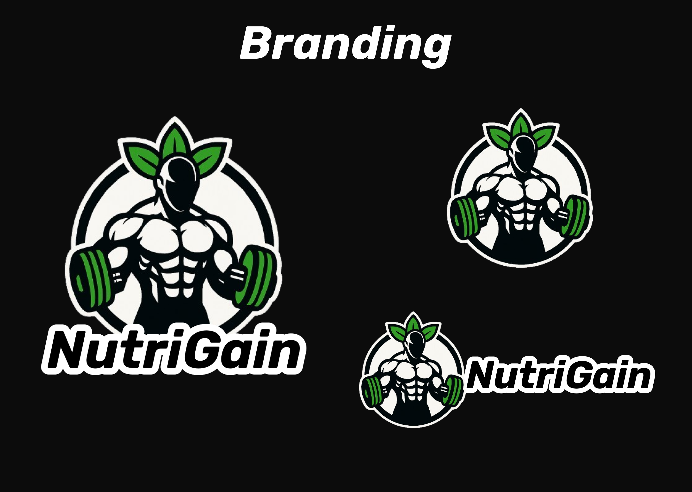

**Typography:**
En cuanto a la fuente de texto, utilizaremos dos tipografías de Google Fonts: Mulish y Rubik. La primera fuente será de uso general para los párrafos de texto, artículos y anotaciones. Por otro lado, emplearemos Rubik para títulos, subtítulos, encabezados y botones. La escala de cada una de estas fuentes variará de acuerdo a las reglas de estilos aplicadas para los diseños responsivos encontrados en la Landing Page y la aplicación web.

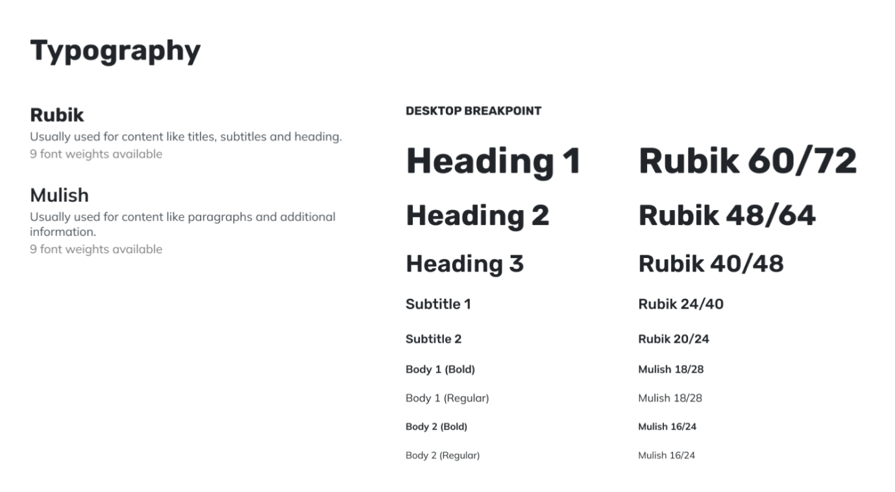

**Spacing System:**
Para el sistema de espaciados, mantendremos una cantidad de 5 píxeles de distancia entre un elemento y otro distribuido en la interfaz.

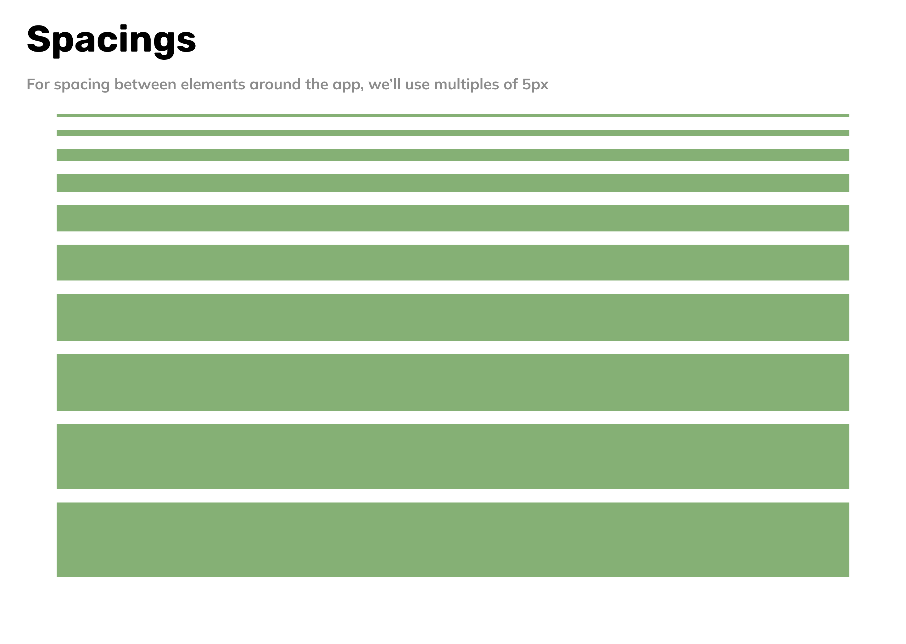

**Colors:**
Como última guía de estilos, escogimos colores que podrían agregar dinamismo, energía y pasión por la ruta a escoger en la aplicación.

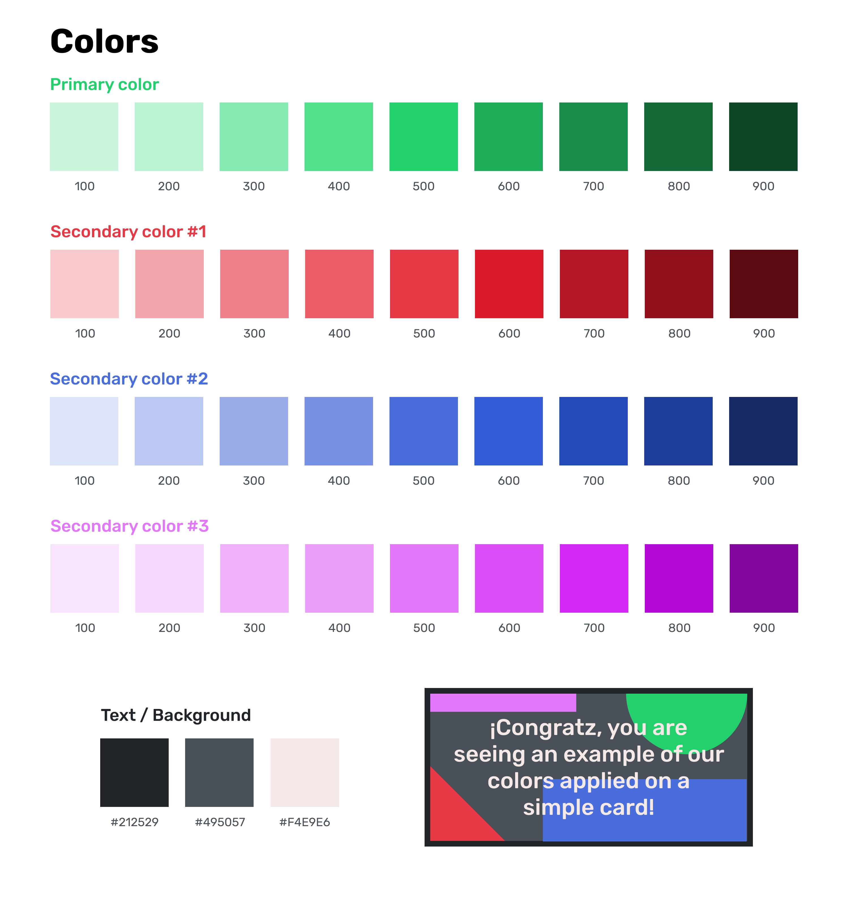

### 4.1.2. Web Style Guidelines

Como startup, establecimos algunos aspectos de estilo con los que contará nuestra landing page y la aplicación web.

-**Interfaz intuitiva y avatar de guía inicial:**
En el caso de la aplicación web, cada vista contará con una ruta de uso intuitiva y un avatar personalizable que te ayuda con la primer interacción con una vista nueva, a modo de tutorial. Mientras que, en la landing page, se utilizarán convenciones y una jerarquía clásica propia de las landing page.

-**Contraste de colores condicionales:**
Como se mencionó en la guía de estilos generales, la interfaz podría cambiar de color, de modo que uno de los colores secundarios seleccionados puede reemplazar al color primario. Por ende, este color condicional combinará con el tema que escoja el usuario (tema claro u oscuro).

-**Diseño minimalista e impecable:**
La aplicación web tendrá un diseño minimalista, de modo que la información sea concisa y no resulte tedioso al leer.

## 4.2. Information Architecture

### 4.2.1. Organization Systems

Como equipo, decidimos que vamos a utilizar una estructura jerárquica (Hierarchical structure) para la landing page, con el fin de ofrecer nuestro producto y explicar sus beneficios desde las primeras capas que se visualizan al cargar la página por primera vez.

Por otro lado, la aplicación web contaría con una estructura secuencial (Sequential structure), debido a que se busca realizar una serie de pasos diariamente e ir registrando todo de forma constante. Además, las funcionalidades de paga también seguirán esta estructura, puesto que siguen una dinámica similar de completar un objetivo o buscan personalizar algo en base a las preferencias del usuario.

### 4.2.2. Labeling Systems

Dado que emplearemos un enfoque minimalista, la cantidad de texto en una vista sería reducida y, en su lugar, habrían más íconos o imágenes que ilustren lo que se busca realizar en dicha vista.

Para el uso de los botones, utilizaremos diferentes escalas de los colores detallados en nuestra guía de estilos.

### 4.2.3. SEO Tags and Meta Tags

**Landing Page**

```html
<meta charset="UTF-8" />
<meta http-equiv="X-UA-Compatible" content="IE=edge" />
<meta name="viewport" content="width=device-width, initial-scale=1.0" />
<link rel="shortcut icon" href="./images/favicon.png" type="image/x-icon" />
<title>NutriGain | El camino nutritivo definitivo</title>
<meta
  name="keywords"
  content="gimnasio,gym,nutrición,alimentación+saludable,gym+app,entrenamiento,yoga,deportes,vida+saludable,dieta,ejercicios"
/>
<meta
  name="description"
  content="Escoge un camino nutricional y SÉ TU MEJOR VERSIÓN. Organiza tu dieta y rutina de ejercicios entre MÁS DE 1000 COMBINACIONES POSIBLES."
/>
```

### 4.2.4. Searching Systems

Los sistemas de búsqueda de nuestra aplicación realizarán consultas a APIs propias que irán creciendo con el paso del tiempo: una de comida y otra de ejercicios.

### 4.2.5. Navigation Systems

La forma de navegación para la landing page será mediante un header con botones que te redireccionan a cada sección de la página. Mientras que para la aplicación web, crearemos un sidebar con todas las vistas que necesita el usuario para disfrutar de las funcionalidades más importantes que ofrecemos.

### 4.3. Landing Page UI Design

A continuación, presentamos los bosquejos y diseños generales que tendrá la landing page inicialmente. Utilizamos la herramienta Figma para generar prototipos de diseño web que luego plasmaremos en la página oficial ya codificada y publicada en línea.

Enlace a los Wireframes: [Figma NutriGain Wireframes](https://www.figma.com/design/LJgdFUywR8wJLzGuRmfKMh/NutriGain-Media?node-id=155-2)

Enlace a los Mock-Ups: [Figma NutriGain Mockups](https://www.figma.com/design/LJgdFUywR8wJLzGuRmfKMh/NutriGain-Media?node-id=155-3)

#### 4.3.1. Landing Page Wireframe

<div align="center">

**Sección Header**


**Sección Hero**


**Sección Sobre el Producto**

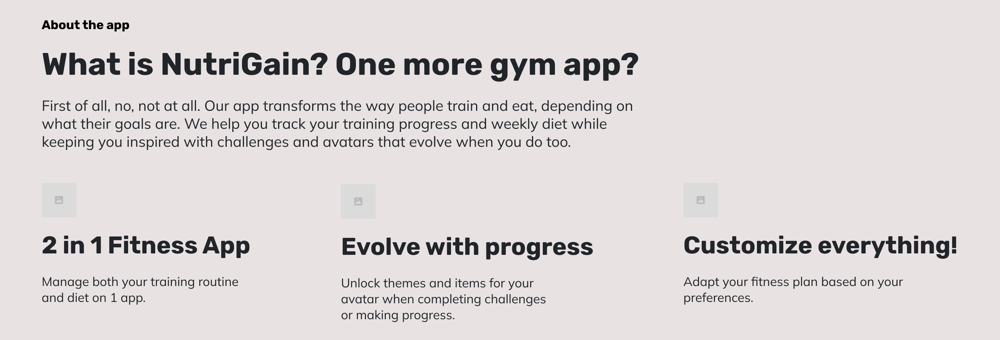

**Sección Paths**

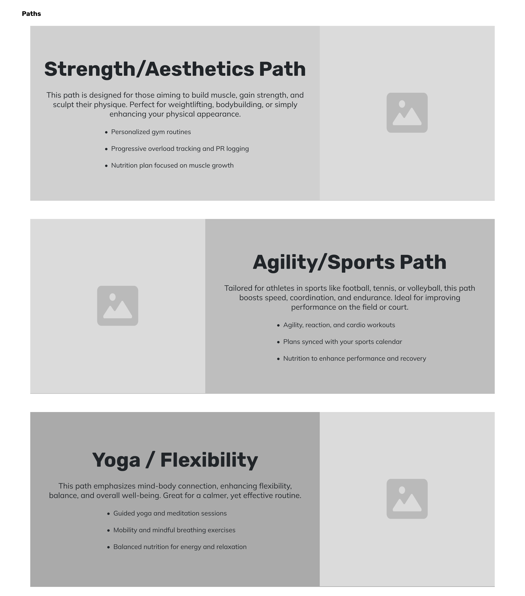

**Sección Pricing**

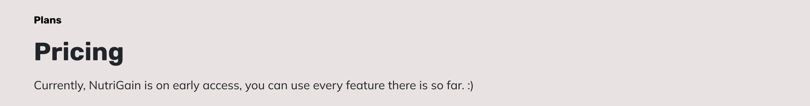

**Sección Sobre Nosotros**

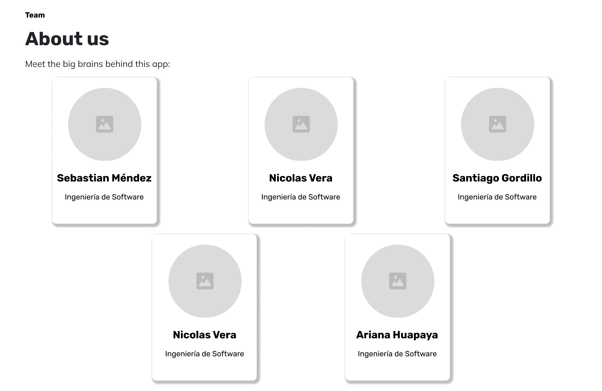

**Sección Footer**


</div>

### 4.3.2. Landing Page Mock-up

<div align="center">

**Sección Header**


**Sección Hero**
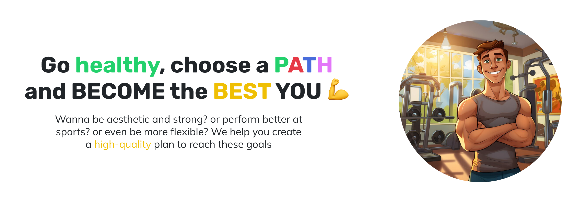

**Sección Sobre el Producto**
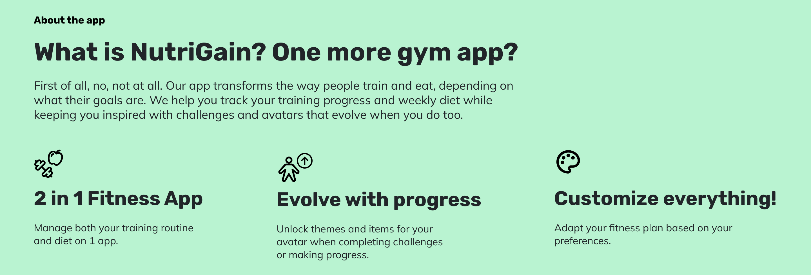

**Sección Paths**


**Sección Pricing**
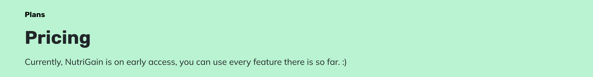

**Sección Sobre Nosotros**


**Sección Footer**
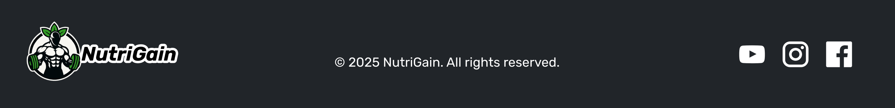

</div>

## 4.4. Web Applications UX/UI Design

### 4.4.1. Web Applications Wireframes

### 4.4.2. Web Applications Wireflow Diagrams

### 4.4.3. Web Applications Mock-ups

### 4.4.4. Web Applications User Flow Diagrams

## 4.5. Web Applications Prototyping

## 4.6. Domain-Driven Software Architecture

Para el diseño de estos diagramas, decidimos como equipo utilizar Structurizr, una herramienta que permite su diseño mediante líneas de código.

### 4.6.1. Software Architecture Context Diagram

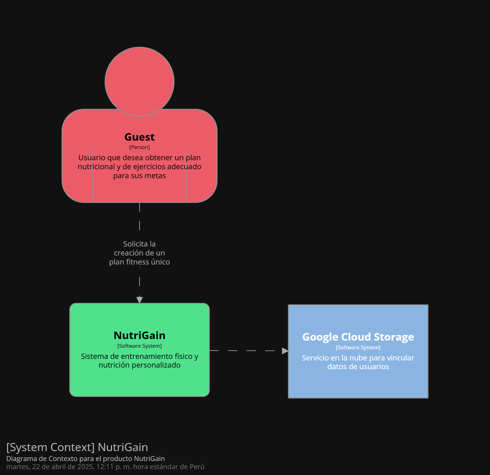

**Elementos del diagrama:**

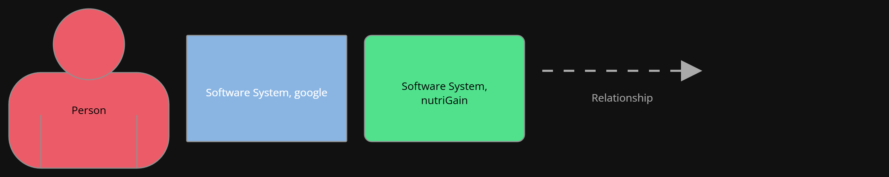

### 4.6.2. Software Architecture Container Diagrams

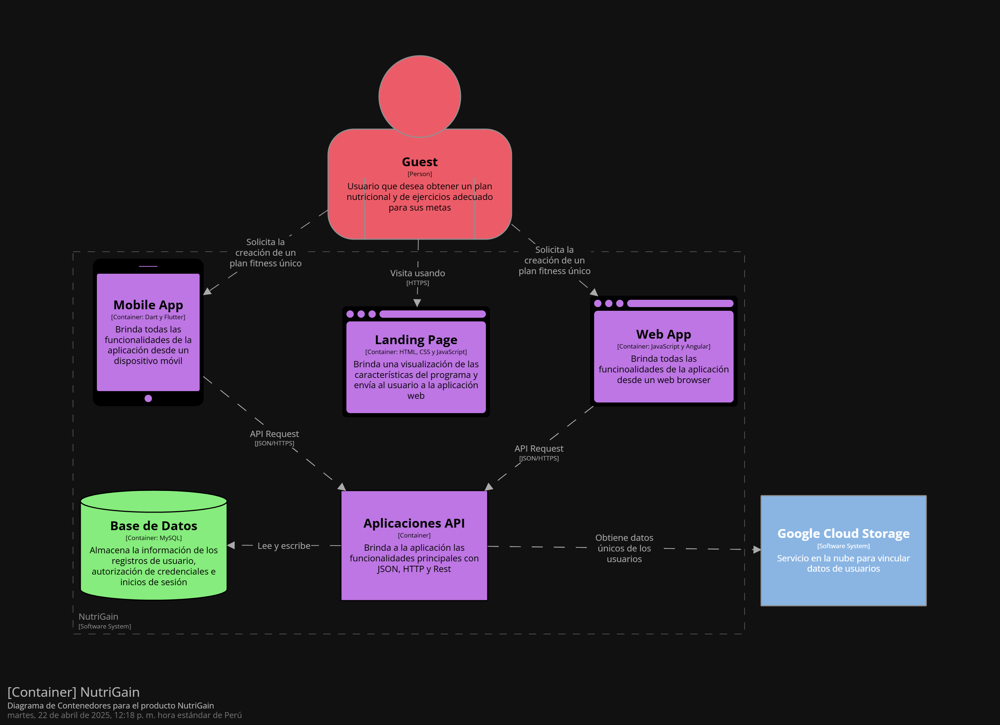

**Elementos del diagrama:**

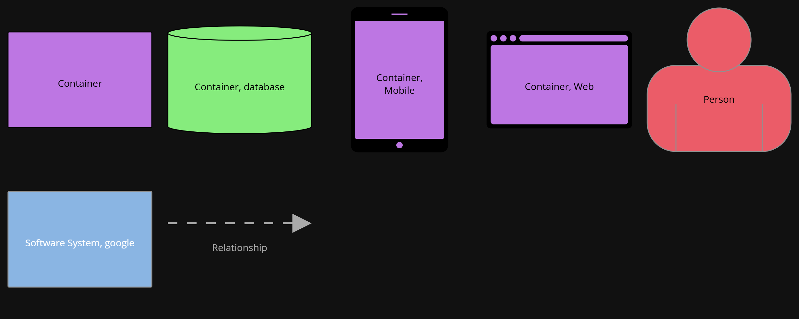

### 4.6.3. Software Architecture Components Diagrams

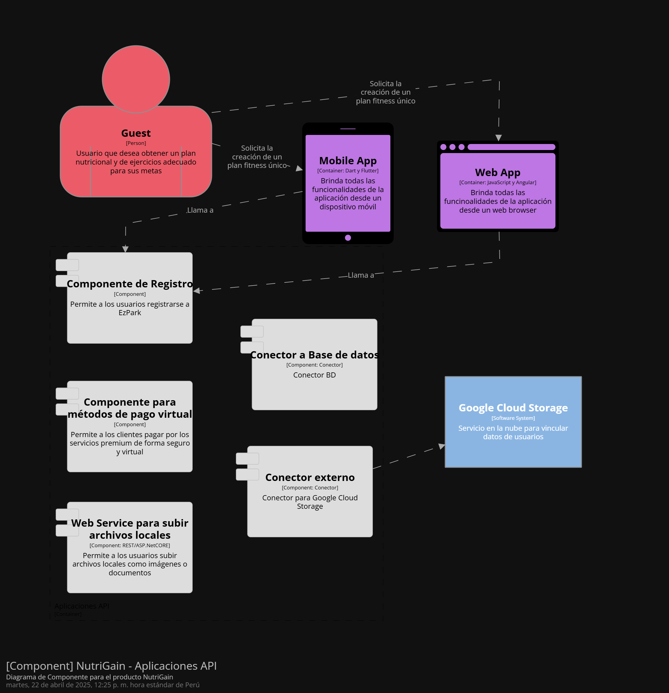

**Elementos del diagrama:**

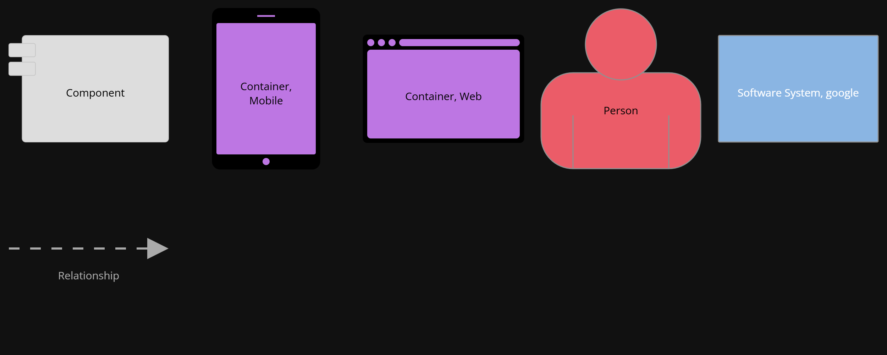

## 4.7. Software Object-Oriented Design

### 4.7.1. Class Diagrams

  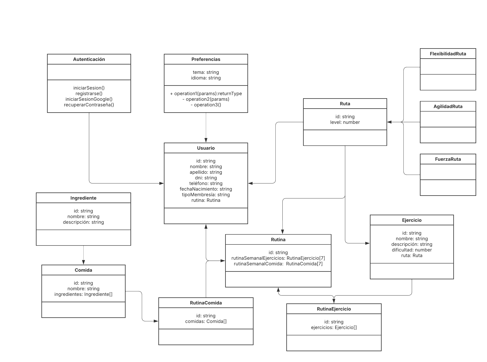

### 4.7.2. Class Dictionary

**Class Usuario**

| Attribute       | Type    | Description               |
| --------------- | ------- | ------------------------- |
| id              | string  | Unique code for user      |
| nombre          | string  | Name of user              |
| apellido        | string  | Last name of user         |
| dni             | string  | Identity document of user |
| teléfono        | string  | Phone number of user      |
| fechaNacimiento | string  | Birthday of user          |
| tipoMembresia   | string  | Membership type of user   |
| rutina          | Rutina  | Unique routine for user   |

**Class Ejercicio**

| Attribute       | Type    | Description               |
| --------------- | ------- | ------------------------- |
| id              | string  | Unique code for exercise  |
| nombre          | string  | Name of exercise          |
| descripcion     | string  | Description of exercise   |
| dificultad      | number  | Dificulty of exercise     |
| ruta            | Ruta    | Path type of exercise     |

**Class Ruta**

| Attribute       | Type    | Description               |
| --------------- | ------- | ------------------------- |
| id              | string  | Unique code for path      |
| level           | number  | Path level reached        |

**Class Comida**

| Attribute       | Type    | Description               |
| --------------- | ------- | ------------------------- |
| id              | string  | Unique code for food      |
| nombre          | string  | Name of food              |
| ingredientes    | Ingrediente[]| Ingredients of food  |


**Class Ingrediente**

| Attribute       | Type    | Description               |
| --------------- | ------- | ------------------------- |
| id              | string  | Unique code for ingredient|
| nombre          | string  | Name of ingredient        |
| descripcion     | string  | Description of ingredient |

**Class RutinaComida**

| Attribute       | Type    | Description               |
| --------------- | ------- | ------------------------- |
| id     | string  | Unique code for daily diet routine |
| comidas         | Comida[]| Foods included on diet    |

**Class RutinaEjercicio**

| Attribute       | Type    | Description               |
| --------------- | ------- | ------------------------- |
| id | string  | Unique code for daily exercise routine |
| ejercicios   | Ejercicio[]| Exercises included on diet|

**Class Rutina**

| Attribute       | Type    | Description               |
| --------------- | ------- | ------------------------- |
| id              | string  | Unique code for routine   |
| rutinaSemanalE| RutinaEjercicio[7]| Exercise routine per day|
| rutinaSemanalC| RutinaComida[7]| Diet routine per day|

**Class Preferencias**

| Attribute       | Type    | Description               |
| --------------- | ------- | ------------------------- |
| tema            | string  | Theme applied on app      |
| idioma          | string  | Language applied on app   |

## 4.8. Database Design

### 4.8.1. Database Diagram

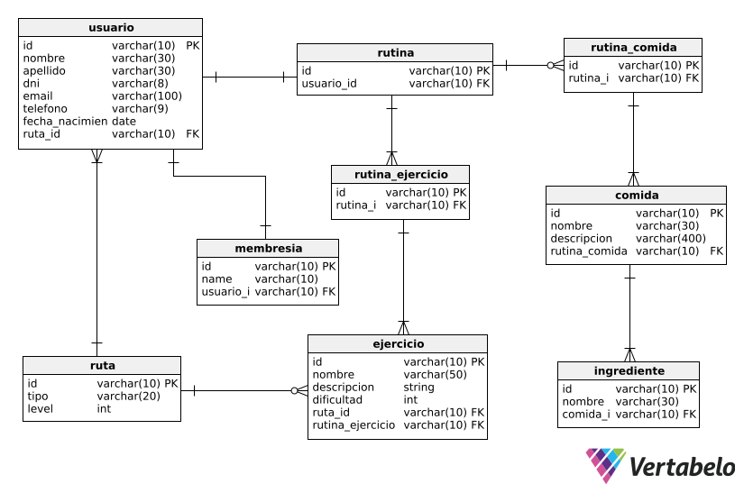


# Capitulo V: Product Implementation, Validation & Deployment
## 5.1. Software Configuration Management
- ### 5.1.1. Software Development Environment Configuration
Para el desarrollo de NutriGain, se adoptó una estrategia basada en entornos especializados para cada componente de la solución: Landing Page, Aplicación Web y Backend RESTful. Esto permitió garantizar independencia en los despliegues y escalabilidad de cada módulo.

### Desarrollo del Landing Page

El equipo eligió una implementación con HTML, CSS y JavaScript puro, priorizando la carga rápida y la simplicidad en el diseño. Esta página sirve como presentación comercial de la aplicación y punto de entrada para nuevos usuarios interesados en conocer los beneficios del enfoque fitness personalizado de NutriGain.

Las herramientas empleadas son las siguientes:

### Live server:

Utilizado para agilizar el desarrollo de la Landing Page, esta herramienta permitió visualizar en tiempo real cada cambio hecho en el código, mejorando así la productividad y reduciendo errores de diseño visual.


<div style="text-align: center;">
    
</div>


### Git y GitHub:

Se decidió hacer uso de estas herramientas por la razón de que hoy en día es un estándar usar Git para el control de versiones de software y se eligió GitHub por ser la plataforma más popular y fácil de usar para crear y manejar repositorios de software, tener funciones para ver los cambios, commits, pull requests y entre otros. El enlace de descarga del instalador de GitHub Desktop es [GitHub Desktop](https://github.com/apps/desktop)


<div style="text-align: center;">
    
</div>


### Desarrollo de la Aplicacion Web

La aplicación web sera construida con Angular en el frontend, lo cual facilitara la creación de una interfaz dinámica para personalizar rutinas, visualizar el progreso del usuario y controlar el avatar fitness. El backend sera desarrollado con Java y Springboot, ideal para estructurar los servicios RESTful que gestionan los planes de nutrición, estadísticas y retos semanales aleatorios.

Las herramientas claves son las siguientes:


### JetBrains WebStorm:

Se eligió esta herramienta para el desarrollo del frontend de NutriGain ya que ofrece integración nativa con Vue.js, utilizado para implementar la lógica de la interfaz de usuario personalizada. WebStorm también brinda autocompletado inteligente, detección de errores en tiempo real y compatibilidad con componentes modulares, lo que facilitó el trabajo colaborativo entre los desarrolladores.

<div style="text-align: center;">
    
</div>

### JetBrains IntelliJ IDEA:

Esta herramienta fue clave para implementar el backend con Java y Springboot, ya que proporciona un entorno de desarrollo robusto para servicios RESTful y permite integrar fácilmente bases de datos y lógica de negocio. Su compatibilidad con Java y sus herramientas de depuración permitieron mantener el control sobre la lógica de personalización de rutinas y planes alimenticios.


<div style="text-align: center;">
    
</div>


### Node.js y npm:

Seran necesarios para la gestión de dependencias del proyecto frontend en Angular, como frameworks de diseño, librerías de gráficos de progreso y validadores de formularios. Además, el entorno Node permitió ejecutar scripts de compilación y pruebas unitarias.

<div style="text-align: center;">
    
</div>

Esta separación por entornos y herramientas permitió una mayor eficiencia en la entrega y pruebas.


- ### 5.1.2. Source Code Management

Para mantener el orden al desarrollar una solución y evitar conflictos o superposiciones de información, los proyectos se trabajaron en un organización de GitHub y dentro de esta se encuentran los diferentes repositorios para cada proyecto cuyos enlaces de los repositorios son los siguientes:

Repositorio para el [landing page](https://github.com/UPC-NutriGain/Landing-Page)

Repositorio para los [tests de aceptación]()

Repositorio de la aplicación web :
- [FrontEnd]()
- [Backend]()

Se aplicó el modelo de ramas GitFlow, con una estructura compuesta por:
- *main*: que almacenará las versiones estables y finales

- *develop*: donde se irán integrando los cambios implementados por cada feature y estará en constante actualización

- *feature/*: nuevas características, como edición del perfil o seguimiento gráfico de progreso

Para los commits se adoptó la convención Conventional Commits, permitiendo organizar fácilmente los cambios mediante etiquetas como *feat, fix, docs,* entre otros

<div style="text-align: center;">
    
</div>


- ### 5.1.3. Source Code Style Guide & Conventions

Se definieron guías de estilo para cada tecnología utilizada, con el objetivo de garantizar coherencia y facilitar el mantenimiento.

- **HTML/CSS:** etiquetas en minúsculas, cierre correcto de elementos, nombres de clase descriptivos en kebab-case, uso de propiedades abreviadas y alt obligatorio en imágenes.

- **JavaScript:** uso de const y let, evitar variables globales, nombramiento en camelCase, comentarios para funciones complejas.

- **Angular:** uso de estructura modular con separación clara de componentes, servicios y módulos; nombres de archivos en kebab-case (component-name.component.ts), uso de TypeScript estricto (strict: true), anotación de tipos explícitos, preferencia por Observables en servicios HTTP, comentarios en componentes y servicios relevantes.

- **SpringBoot (Java):** nombramiento de clases en PascalCase, nombramiento de variables y métodos en camelCase, separación de capas (Controller, Service, Repository) siguiendo el patrón MVC, manejo de excepciones personalizado, uso de anotaciones estándar de Spring (@Service, @Repository, @RestController), documentación de métodos públicos con JavaDoc.

- **Gherkin:** estructuración clara con Given-When-Then, uso de tablas para parámetros complejos y separación de escenarios.


- ### 5.1.4. Software Deployment Configuration

### **Despliegue del Landing Page**

La landing page fue desplegada con GitHub Pages, configurando la rama principal como fuente de publicación. Se eligió esta opción por su facilidad de integración con GitHub, cero costos de hosting y rapidez para realizar actualizaciones visuales.

Para realizar esto se realizaron los siguientes pasos:

1. Una vez que se haya lanzado el release al repositorio y las ramas estén actualizadas, se procede a ingresar a GitHub, luego acceder al repositorio del proyecto y seguidamente hacer click en la pestaña “Settings”, buscar el ítem “Pages” del menú lateral.


2. Seleccionar la rama principal y confirmar los cambios, luego de esto GitHub comenzará el proceso de deploy. Cuando GitHub tenga listo el enlace público, este se podrá ver desde el mismo menú en la parte superior.


Link de la [landing page](https://github.com/UPC-NutriGain/Landing-Page)


### **Despliegue de la Aplicación Web**

Para el frontend de la aplicación NutriGain, se utilizó Vercel, aprovechando sus capacidades de CI/CD, soporte para frameworks modernos y facilidad de configuración para proyectos en Vue.js.

<div style="text-align: center;">
    
</div>


### **Despliegue del Backend RESTful**

El backend fue desplegado en Render, donde se configuraron entornos de desarrollo y producción con acceso a base de datos. Además, se generó documentación interactiva con Swagger, accesible públicamente en:

Link de la [BackEnd RESTful]()


## 5.2. Landing Page, Services & Applications Implementation

- ### 5.2.1. Sprint 1
- ### 5.2.1.1. Sprint Planning 1

  Durante esta primera planificación del sprint, el equipo definió los objetivos clave para comenzar a dar vida a la app NutriGain desde su página de presentación.
  El foco principal fue diseñar una Landing Page atractiva y funcional que refleje de manera clara qué es NutriGain, sus caminos fitness y cómo funciona el sistema del avatar y los retos.
  Esta planificación estableció las bases visuales y comunicativas del producto.

    -   **Sprint Goal:** Crear una versión inicial de la Landing Page que sea visualmente atractiva, informativa y funcional para captar el interés de los usuarios potenciales y explicar los beneficios únicos de NutriGain (como el camino fitness, el avatar personalizado, el plan nutricional y los retos extremos).

    -  ####  Fecha de planificación: 10 de abril de 2025

       #### Herramientas utilizadas:

        - **Trello:** Para organizar el backlog de historias de usuario y asignar tareas.

        - **GitHub Projects:** Para el seguimiento técnico de commits, ramas y avances del repositorio.

        - **Google Meet:** Para reuniones virtuales y acuerdos de planificación.

        - **Figma :** Se sugirió como herramienta para prototipado visual, especialmente útil si se desea incluir una imagen del wireframe inicial.


-   ### 5.2.1.2. Sprint Backlog 1


|  USER STORY<br/> ID | TITULO           | TASK <br/>ID |  TITULO DE <br/>TAREA | DESCRIPCION |Estimacion<br/>(Horas)|
|----------------|------------------|------|-----------------|-----------------------|----|
| ID01           |Apartado del Header|T01  |Header responsivo|Desarrollo e implementacion de los estilos que corresponden al encabezado de manera responsive|3|
| ID02          |Apartado de Footer|T02|Footer responsivo|Desarrollo e implementación del pie de página con enfoque en compatibilidad móvil y estructura clara|3|
|ID03           |Seccion Hero|T03|Hero responsivo|Diseño de la primera sección visual con título principal, subtítulo y llamada a la acción para usuarios nuevos|2|
|ID04           |Barra de navegacion|T04|Navegacion responsiva|Implementación del menú de navegación principal con anclajes a cada sección y comportamiento adaptativo.|3|
|ID05           |Testimonials|T05|Testimonios|Desarrollo de una sección con opiniones de usuarios ficticios, representando experiencias con NutriGain|3|
|ID06           |Sobre Nosotros|T06|Info del equipo|Sección con información sobre los desarrolladores del proyecto y la inspiración detrás de NutriGain.|2|
|ID07           |Interfaz Responsive General|T07 |Responsive completo|Asegurar que toda la landing funcione correctamente en distintos dispositivos (móviles, tablets, escritorio).|3|


- ### 5.2.1.3. Development Evidence for Sprint Review

Durante el sprint, se realizaron múltiples commits en GitHub con etiquetas claras. Las tareas fueron desarrolladas en ramas individuales y luego fusionadas a la rama main mediante pull requests.
Se adjuntaron capturas de pantalla de cada sección funcional implementada para validación.


- ### 5.2.1.4. Testing Suite Evidence for Sprint Review

Para este sprint, las pruebas se centraron en revisión manual de interfaz y pruebas básicas de visualización. No se incorporó aún un framework automatizado, pero se validó la correcta carga de elementos, adaptabilidad responsive y funcionamiento de navegación.

- ### 5.2.1.4. Execution Evidence for Sprint Review

Se hizo una demostración funcional del Landing Page en un entorno en vivo. Se verificó la navegación entre secciones, la carga de imágenes, la adaptación en móviles y se presentó a usuarios externos para retroalimentación básica.


- ### 5.2.1.5. Services Documentation Evidence for Sprint Review

No aplica para este sprint, ya que aún no se integran los servicios backend. Esta documentación se planifica para el Sprint 2.

- ### 5.2.1.6. Software Deployment Evidence for Sprint Review

El Landing Page fue desplegado exitosamente en GitHub Pages, quedando accesible públicamente para evaluación y pruebas por parte del equipo.


Mediante el siguiente boton pueden apreciar el [LandingPage](https://github.com/UPC-NutriGain/Landing-Page)

- ### 5.2.1.7. Team Collaboration Insights during Sprint

  Durante el Sprint 1, el equipo mostró buena comunicación y trabajo distribuido. Se coordinaron mediante WhatsApp y reuniones por Meet. Cada integrante tomó ownership de sus tareas, y el seguimiento se realizó en Trello. Las decisiones técnicas se discutieron en conjunto antes de implementarlas.


